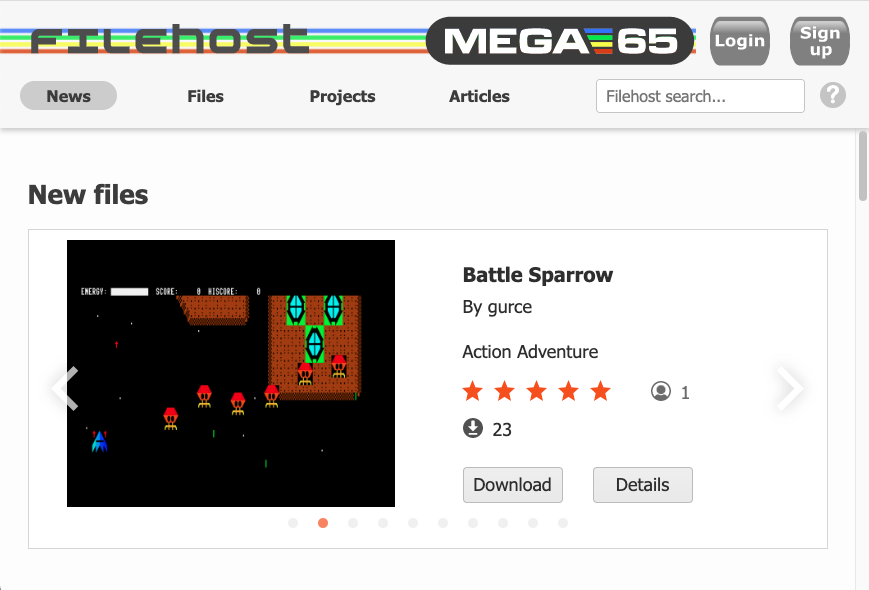
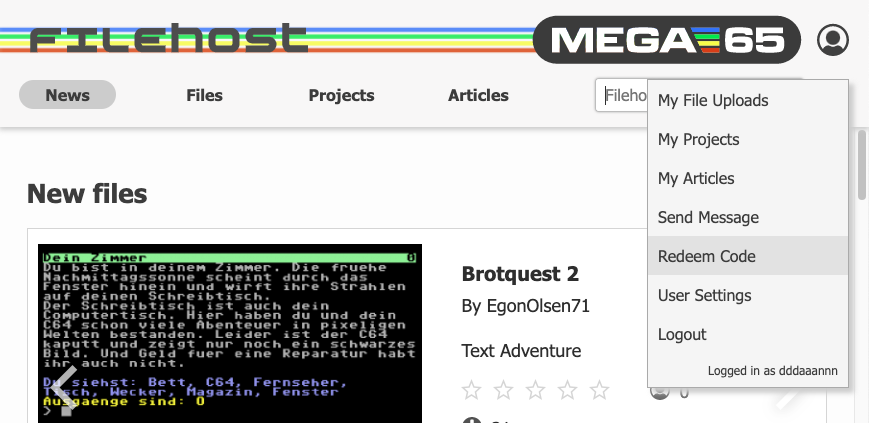
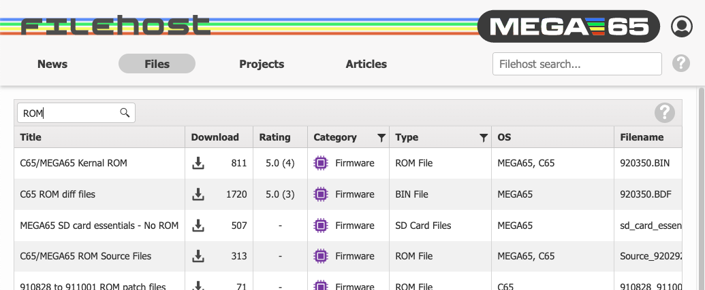

# Accessing the MEGA65 Filehost

[The MEGA65 Filehost website](https://files.mega65.org/html/main.php) is the official repository for MEGA65 firmware and ROM updates, tools, games, applications, and documentation.



Most files are publicly available, but a few important files require an account and verification of ownership to access. Specifically, the ROMs based on the original C65 contain material that is only licensed to owners of the MEGA65. Creating an account also lets you post ratings and leave comments.

To create and account and register your MEGA65:

1. Visit the Filehost website: [files.mega65.org](https://files.mega65.org/)
2. Click "Sign up" and complete the prompts. If you already have an account, click "Login."
3. Once you are signed in, click the person icon in the upper right (where the sign up/login buttons were) to open the menu, then select Redeem Code.
4. In the dialog that opens, enter the nine-character registration code that was included with your MEGA65 on a piece of paper. It looks something like `123-ABC-456`.
5. Open the menu again and "Logout," then "Login" again.



To verify that you can see the licensed files, click "Files," click the search field, type "ROM" and press enter. If you are registered correctly, the file "C65/MEGA65 Kernal ROM" should be one of the results.



```{tip}
Not seeing the licensed ROM after registering? Try logging out, then log back in again.
```
