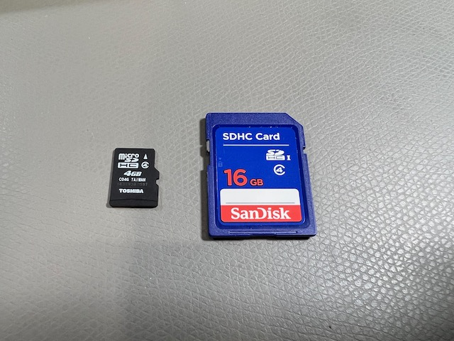

# Important concepts

Now that you've had a taste of what the MEGA65 can do, it's time to prepare your computer for long term use. But first, let's discuss some important concepts of how the MEGA65 works.

## SD memory cards

The MEGA65 uses an SD memory card for its primary data storage. There are _two_ SD card slots: a full-size SD card slot inside the machine, and a microSD card slot accessible on the back of the machine. The MEGA65 comes bundled with an SD card installed in the internal slot.



MEGA65 only uses one SD memory card at a time. If there is a microSD card in the external slot, it ignores the full-size SD card in the internal slot. The SD card contains the operating system software ("ROM"), firmware ("cores"), and D81 disk images.

I recommend installing a microSD card in the external slot, and leaving the internal card with its factory-installed data intact. Following this Guide, you will set up a microSD card with all of the latest versions of the software. You will use this card to transfer software and data between MEGA65 and your PC.

```{tip}
The User Guide's explanation of SD cards begins on page 23.
```

## Cores

The MEGA65 is powered by a Field Programmable Gate Array (FPGA). An FPGA is a special kind of chip that can be programmed to perform the functions of most any integrated circuit (IC). Like an IC, it is fast, and interacts electronically with the rest of the hardware. Unlike an IC, it can be reprogrammed with new logic at any time. FPGA code is sometimes referred to as _firmware_, a term you may recognize from modern computers and other devices. MEGA65's FPGA is programmed to behave like the complete collection of ICs you would find in a Commodore 65: the CPU, video and sound chips, and so on.

The MEGA65 team continues to make improvements to this firmware, and you will want to update your machine with new firmware as updates become available. Other contributors are developing alternate FPGA programming to simulate other computers, such as a Commodore 64.

To make managing multiple sets of firmware easy, MEGA65 describes each set as a _core_. You will download a core data file (described in the manual as a _bitstream_), copy the file to the microSD card, and follow a procedure to install the core in one of seven user-accessible slots. You can access a menu to tell MEGA65 which core to use.

The MEGA65 always retains a copy of its original factory core (in "slot 0"). If something goes wrong while updating another core, you can always go back to the original version.

```{tip}
This Welcome Guide will describe how to upgrade the MEGA65 core to the latest version. For more general information about cores, see the User's Guide, chapter 6, starting page 47.
```

## ROMs

While the core recreates the hardware of the Commodore 65, the _ROM_ recreates the built-in software of the Commodore 65. This software interfaces with the hardware and provides built-in functionality like BASIC programming.

The original Commodore 65 kept its software on a physical Read-Only Memory (ROM) chip. With MEGA65, this software lives in a file on the SD card named `MEGA65.ROM`. MEGA65 loads this into memory when you turn it on. This file contains the original software from the C65 ROM chip licensed from the copyright holder, with many fixes and improvements. You can upgrade the operating system by replacing this file on the SD card.

```{note}
Newer versions of the MEGA65 ROM require a newer version of the MEGA65 core. Following this Guide, you will update both the ROM and the core together.
```

```{tip}
The User Guide describes ROM files starting on page 26.
```

## The Hypervisor

The MEGA65 has additional built-in functionality not present in the original Commodore 65, such as for managing the startup sequence, SD cards, cores, and configuration. This operating system is known as the Hypervisor.

You see the Hypervisor in action every time you turn on your MEGA65. Normally this screen displays some messages then quickly disappears. If you want to pause the Hypervisor to read these messages, hold the Ctrl key during startup. Release Ctrl to continue.

## PAL and NTSC

Way back in the ancient times of analog video, there were competing standards for the transmission and rendering of video signals. European countries used a standard called Phase Alternate Line (PAL), which had a picture that was 625 interlaced lines tall and was transmitted and displayed at 25 interlaced frames per second, using a beam that swept the screen 50 times per second (50 Hz). The United States, Japan, and other countries used a standard developed by the National Television Standards Committee (NTSC), which opted for a shorter 525 interlaced lines at a faster 29.97 interlaced frames per second, or about 60 sweeps per second (60 Hz). Makers of devices like the Commodore 64 that output analog video signals released different versions of the hardware for each video standard in the appropriate countries.

Both the screen height and the refresh rate affect the execution of computer programs written for these old machines. Software has to use precise timing to render graphics for each frame, and is written to expect a screen with a given number of scan lines. Some software like games use the refresh rate to control the timing of other events like playing music. Without extra work by a programmer to account for the differing standards, a program written to be compatible with one video standard might run too fast or too slow, have erratic graphical behavior, or just not work at all on a machine built for the other standard.

The MEGA65 has an analog VGA video output and a digital HDMI video output. Both of these standards are newer than PAL and NTSC and can support multiple resolutions and refresh rates. The MEGA65 must still be set to one of these modes (in Configuration or the Freeze menu) to support the vintage software that might be expecting one or the other. The chances are good that the monitor you are using with your MEGA65 can support the video signal it outputs in either PAL or NTSC mode, possibly with some manipulation of the image to account for the differing heights. If you are having difficulty running a program, try switching to the other video mode. You may need to adjust your monitor's picture settings.
