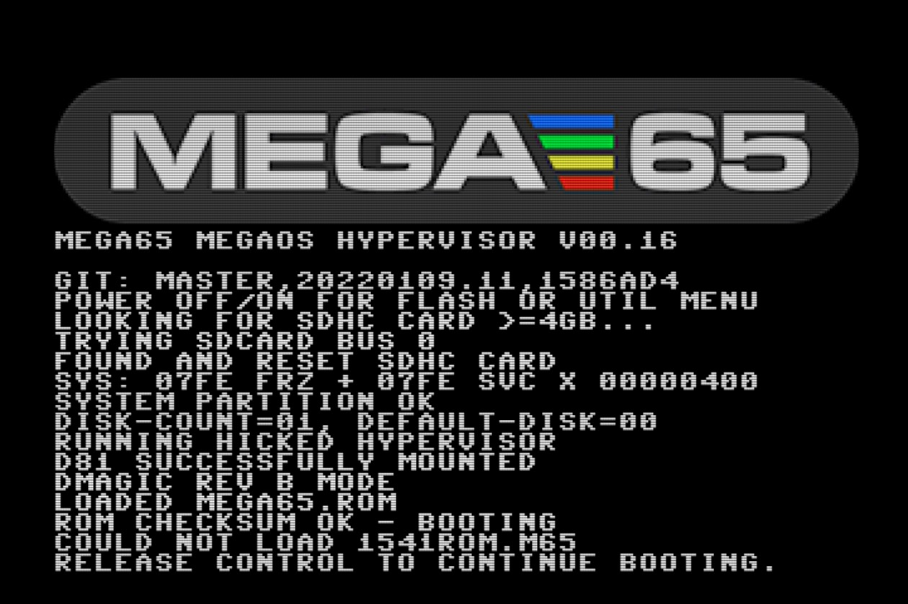
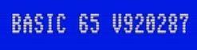

# Determining the versions of things

The MEGA65 core (which includes the Hypervisor), ROM, and Freeze menu are all upgradable components. It is often useful to know which versions of these components are currently operating your machine.

## The MEGA65 core version

One way to determine which version of the MEGA65 core is installed is to turn off the computer, then hold the Ctrl key while turning on the computer to pause the Hypervisor screen.



The MEGA65 factory core shipped with batch #1 in 2022 has this version number:

```
GIT commit: master,20220109.11,1586ad4
```

(Or just `1586ad4`.) As of this writing, the latest available version of the MEGA65 core is:

```
GIT commit: development,20220506.10,bdeeb15
```

(Or just `bdeeb15`.)

Alternatively, you can see the version of the MEGA65 core while the computer is running without turning it off. At any time with the MEGA65 core running, hold the Mega key (the fancy M in the lower left of your keyboard) and press Tab. Welcome to "Matrix mode!" This is a special mode used by the MEGA65 development team to tweak the memory of the computer while it is running, among other things. It also displays the version of the running MEGA65 core. Press Mega+Tab again to exit.

## The MEGA65 ROM version

You can determine the version of the MEGA65 ROM that is running from the BASIC title screen.



The original Commodore 65 ROM data used a number resembling a date to represent the software version, such as `910828` or `911001`. The MEGA65 enhanced versions of the original ROMs continues the numbering sequentially from `92xxxx`.

The MEGA65 ROM that shipped with batch #1 in 2022 has this version number:

```
920287
```

As of this writing, the latest available version of the MEGA65 ROM is:

```
920350
```

## Hypervisor and Freeze versions

The Hypervisor and Freeze functions have their own version numbers. They are displayed on their respective screens.

To see the Hypervisor screen, hold Ctrl while turning on the computer. As of core `bdeeb15`, the Hypervisor version is v00.16. The Hypervisor is built into the core.

To see the Freeze screen, simply open the menu: hole Restore for a second, then release. As of core `bdeeb15`, the Freeze menu version is v0.1.4. It is possible to upgrade the Freeze menu separately from the core with a file on the SD card.

```{note}
A fix to the issue with the Freeze menu appearing too low on the screen was released in a newer version, but the Freeze menu version number was not incremented. When we upgrade later in this Guide, the Freeze menu version number will not change.
```
