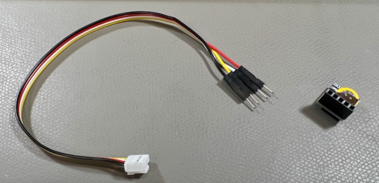
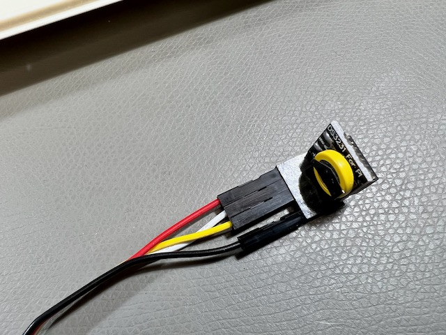
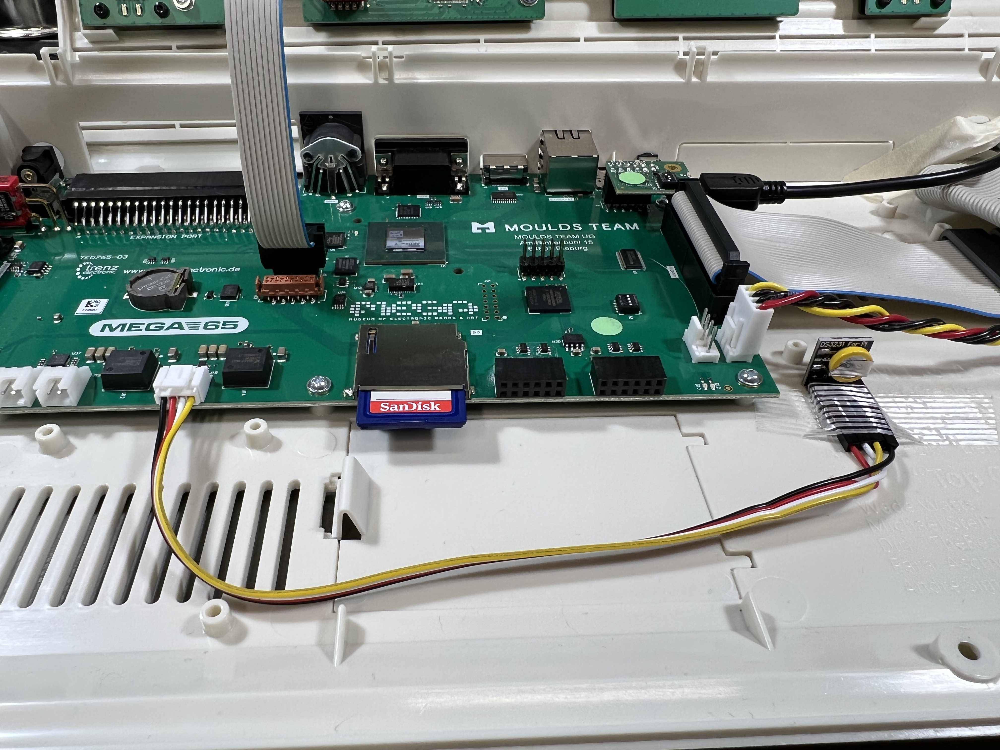
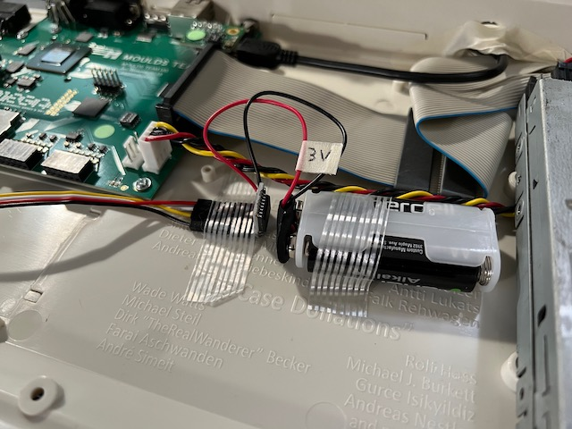
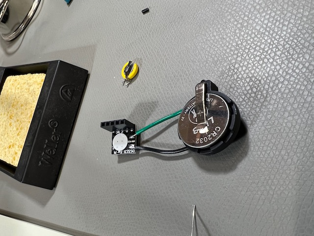

# Known hardware issues

Batch #1 of the MEGA65 hardware shipped to owners in May of 2022. Thanks to the tireless efforts of the MEGA65 team over many years, the result was of satisfyingly high quality, a device that recalls the vintage 8-bit machines of the 1990's while retaining modern advantages like quality key switches.

Being the first batch, some minor fit and finish issues were inevitable. Here are a few issues that were reported in the community Discord, and some suggested remedies.

## The Real-Time Clock doesn't advance the time

A small but significant percentage of MEGA65 owners reported that the Real-Time Clock (RTC) stays stuck at the time you set in the configuration and does not advance, or advances slowly or erratically.

You can test this on your device in several ways:

-   In the configuration utility, set the RTC time, then navigate to another submenu, then navigate back. With a working clock, the time value should have advanced by the correct number of seconds.
-   From the demo disk, find the Vector Clock utility and run it. Check that it advances the time correctly. With a working clock, it should stay up to the correct time indefinitely.
-   From BASIC, use this command to print the contents of the clock: `?TI$` (That's a question mark—a synonym for `PRINT`—followed by the `TI$` string variable.) Do this multiple times, or write a program to print it repeatedly. With a working clock, the value should advance correctly.
-   After setting the time in the configuration utility, turn off the computer, wait a bit, then turn it back on. With a working clock, the time displayed on the BASIC home screen should be accurate.

There is a solution for the RTC issue that involves installing a new part and a connector. If your MEGA65 is affected by this issue, you can purchase the [DS3231 Real-Time Clock](https://www.aliexpress.com/item/3256803522608024.html) and a [Grove 4-pin male jumper cable](https://core-electronics.com.au/grove-4-pin-male-jumper-to-grove-4-pin-conversion-cable-5-pcs-per-pack.html). The cable's four (4) loose pins connect to the RTC unit's five (5) connections as shown in the photo below. With the RTC on top and facing you, from left to right: red, white, yellow, no connection, then black. The Grove connector end only installs one way on the Grove connector on the main board.





You must upgrade to a recent core (such as build 198, f555316) to use the replacement RTC. Remember that when you use the <kbd>Alt</kbd> menu to access the Configuration utility to set the time then save and exit, the MEGA65 will boot into the factory-installed core in slot 0. Turn the computer off then on again to boot into the core in slot 1 and see the replacement RTC working.

If the new replacement RTC does not remember the time that you set when powered off, its battery may be dead. The DS3231 is an old part with a factory-installed non-replaceable battery that starts draining as soon as it is assembled. The battery is the yellow disc with metal pads soldered to the board. With some modest electronics knowhow, you can test the battery with a volt meter, and use a soldering iron to replace the factory-installed battery with a 3 volt battery source, as shown here.



Two AA batteries provide 3 volts. It feels like overkill, but when I tried a CR2032 battery, it didn't provide the full 3 volts required by the RTC unit.



The replacement RTC does not use the battery you installed on the main board. You can remove the main board battery when using the replacement RTC.

```{note}
As of this writing, we are investigating an issue where the MEGA65 sets the hour to "19" every time you turn it on with a replacement RTC connected. See [this Github issue](https://github.com/MEGA65/mega65-core/issues/591) for more information.
```

## Case fit issues

In some cases, the top and bottom pieces of the plastic case do not fit snugly. A common symptom is a noticeable slip when applying downward pressure to the back of the top case. One possible explanation is a mild manufacturing error from when the limited run cases were commissioned years ago.

The plastic is bendable and with gentle pressure can be coerced into a tighter fit. On the Discord chat, we discussed the use of a hair dryer to soften the plastic for gentle reforming. Be careful not to apply too much heat! Do _not_ use a "heat gun," and be judicious when using a hair dryer.

The issue was diagnosed by the manufacturer and will be fixed for future batches. See [Issue: The upper case does not properly align with the lower case on the rear side](https://files.mega65.org?ar=0c0091d3-9b57-4c20-9ed7-5248aa161011).

## Keyboard slouching and sticking Help key

My MEGA65 arrived with its keyboard appearing to slouch below the top case a bit on the right-hand side, and others reported something similar. The spacebar appeared not vertically straight with the top case, and some people reported that the Help and F13 keys get stuck on the top case when pressed all the way down.

I was able to repair mine with a Phillips head screwdriver. I opened the case and noticed that the screws holding the keyboard to the top piece could be driven further. Careful not to apply too much pressure, I tightened these screws to match the depth of the screws on the lefthand side. This repaired the issue for me.

## Jammed floppy disk pathway

Some owners reported that a floppy disk inserted into the disk drive gets stuck when ejected with the eject button. I did not personally encounter this issue, but others reported success repairing this issue by tightening or loosening screws, similar to the other case fit fixes.

See [Issue: Floppy drive eject button and/or inserting floppy disk stuck](https://files.mega65.org?ar=760a45f3-6c72-46c1-8534-59baad2661a0) for more advice.

## C64 cartridge and peripheral compatibility

It is a known issue that not all Commodore 64 cartridges and peripherals work with the current MEGA65 hardware and ROM. The development team is working continuously to improve compatibility over time, well beyond the known-limited C64 compatibility of the original C65 prototype.

Join the `#compatibility` channel on the Discord to discuss any compatibility issues you have found!

## Boot failures with blinking blue LED lights

If the MEGA65 fails to boot its operating system, it will blink the LED lights on the machine in a blue color. This may indicate a problem with the core being loaded. Turn off the power, then hold the No Scroll key and turn it on to access the core selection menu. Select a known-good core, such as the factory-installed core in slot 0.
