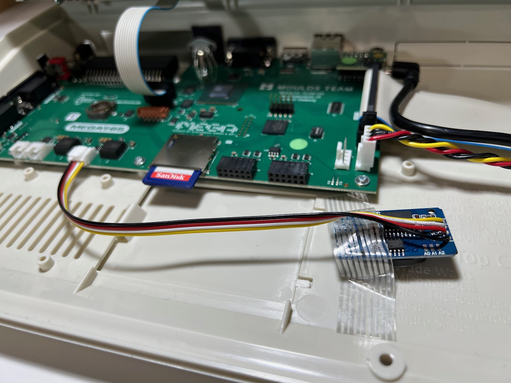
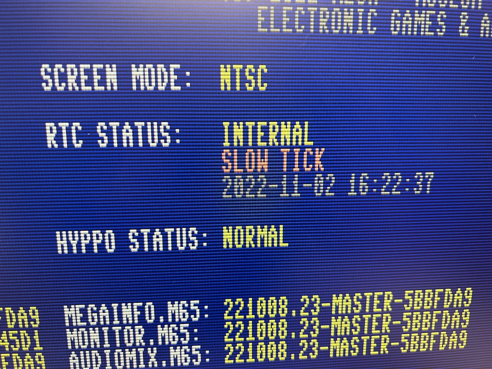
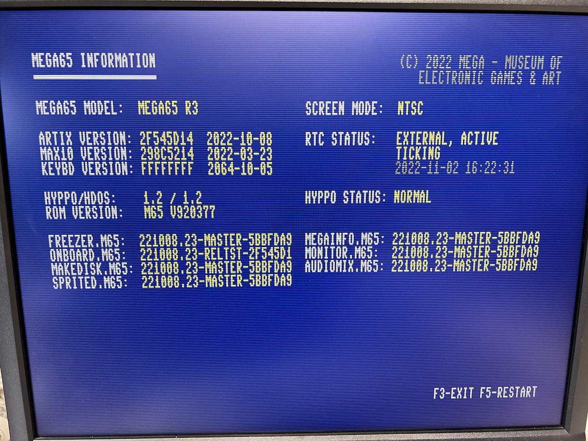

# Known hardware issues

Thanks to the tireless efforts of a team of volunteers and patrons over many years, the MEGA65 hardware is of high quality, a device that recalls the vintage 8-bit machines of the 1990's while retaining modern advantages like quality key switches.

Some minor fit and finish issues were inevitable. Here are a few issues that were reported in the community Discord, and some suggested remedies.

```{note}
Most of these issues have been fixed in the 2024 MEGA65, including the RTC, HDMI back-power, and RF noise.
```

## The Real-Time Clock doesn't advance the time

A significant percentage of MEGA65 units shipped with Real-Time Clock (RTC) hardware that stays stuck at the time you set in the configuration and does not advance, or advances slowly or erratically.

If your MEGA65 has this issue, you can request a replacement RTC unit that attaches to the Grove connector on the main board. The MEGA65 team is making these available **free of charge.** To learn more about this program and to request a Grove RTC:

-   **[Request a Real-Time Clock replacement (Grove RTC)](https://files.mega65.org?ar=ff484da0-d942-4e9b-adf1-3b5a77acaa25)**



To test whether your MEGA65 is affected, use the MegaInfo utility (available in release v0.95 or higher). Open the Freeze menu (hold <kbd>Restore</kbd> then release), then press <kbd>Help</kbd> to run the MegaInfo utility. Give the diagnostic utility a few seconds, and it'll report the "RTC status" of your machine.

My MEGA65 had this issue. Prior to installing the Grove RTC, MegaInfo reported that my built-in ("internal") RTC was ticking slowly:



After installing the Grove ("external") RTC, MegaInfo reported a working clock:



## Failure to boot, and keyboard lights glow when off

Some owners have noticed that the MEGA65 fails to boot when connected to
certain HDMI displays. If this happens, turn off the MEGA65, then see if the
LED lights in the keyboard (power, Shift Lock, Caps Lock, or drive activity) glow or flicker faintly. This
represents an issue known as _HDMI backpower_: the HDMI display is feeding
power along the HDMI connection that is confusing the keyboard controller and
inhibiting the boot sequence.

To confirm that this is the issue, disconnect the HDMI cable from
the back of the MEGA65, turn on the MEGA65, then reconnect the HDMI cable while
the MEGA65 is on. The MEGA65 should now be running correctly.

One workaround is to add an inexpensive HDMI switch between the MEGA65 and the
display. Cheap switches will block HDMI backpower and allow the video signal. Owners have reported success with these (Amazon.de links):

-   [JSAUX HDMI Switch 4K](https://www.amazon.de/dp/B08JTZB2YC); [another from JSAUX](https://www.amazon.com/JSAUX-Switcher-Aluminum-Bi-Directional-Compatible/dp/B08GG4914P/?th=1)
-   [BENFEI 4K HDMI Switch](https://www.amazon.de/dp/B0895J89FB)
-   [Blukar HDMI Switch](https://www.amazon.de/Blukar-Aluminium-Bi-Direction-Unterst%C3%BCtzt-Umschalter-Schwarz/dp/B08V8XD945/)

## Case fit issues

In some cases, the top and bottom pieces of the plastic case do not fit snugly. A common symptom is a noticeable slip when applying downward pressure to the back of the top case. One possible explanation is a mild manufacturing error from when the limited run cases were commissioned years ago.

The plastic is bendable and with gentle pressure can be coerced into a tighter fit. On the Discord chat, we discussed the use of a hair dryer to soften the plastic for gentle reforming. Be careful not to apply too much heat! Do _not_ use a "heat gun," and be judicious when using a hair dryer.

The issue was diagnosed by the manufacturer and will be fixed for future batches. See [Issue: The upper case does not properly align with the lower case on the rear side](https://files.mega65.org?ar=0c0091d3-9b57-4c20-9ed7-5248aa161011).

## Keyboard slouching and sticking Help key

My MEGA65 arrived with its keyboard appearing to slouch below the top case a bit on the right-hand side, and others reported something similar. The spacebar appeared not vertically straight with the top case, and some people reported that the Help and F13 keys get stuck on the top case when pressed all the way down.

I was able to repair mine with a Phillips head screwdriver. I opened the case and noticed that the screws holding the keyboard to the top piece could be driven further. Careful not to apply too much pressure, I tightened these screws to match the depth of the screws on the lefthand side. This repaired the issue for me.

## Jammed floppy disk pathway

Some owners reported that a floppy disk inserted into the disk drive gets stuck when ejected with the eject button. I did not personally encounter this issue, but others reported success repairing this issue by tightening or loosening screws, similar to the other case fit fixes.

See [Issue: Floppy drive eject button and/or inserting floppy disk stuck](https://files.mega65.org?ar=760a45f3-6c72-46c1-8534-59baad2661a0) for more advice.

## Boot failures with blinking blue LED lights

If the MEGA65 fails to boot its operating system, it will blink the LED lights on the machine in a blue color. This may indicate a problem with the core being loaded. Turn off the power, then hold the No Scroll key and turn it on to access the core selection menu. Select a known-good core, such as the factory-installed core in slot 0.
