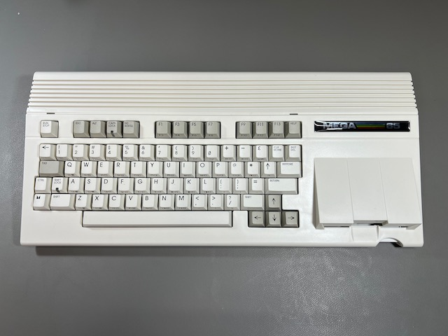

MEGA65 Welcome Guide 2022
=========================

Hello! You've reached the MEGA65 Welcome Guide 2022. This Guide is intended for new owners of the `MEGA65 personal computer <https://mega65.org/>`_, specifically those that received their MEGA65 in the year 2022. It contains answers to common questions from early adopters not (yet) answered in the official documentation about the first production batch of hardware and factory-installed software, and recommends best practices for continued enjoyment of your new computer. It was written as an unofficial supplement to the MEGA65 User's Guide included with the computer.

This is meant to be a *short-lived* living document. Eventually, official documentation updates and future manufacturing runs will make this Guide obsolete. If you're one of the first 1,400 people to purchase a MEGA65, this Guide will help you get up and running.

Oh hi, I'm `Dan <https://www.dansanderson.com/>`_, known as dddaaannn#7325 in `the MEGA65 Discord <https://discord.gg/5DNvESf>`_. If you notice anything in this guide that needs updating, or if you discover a topic not covered by the official manual that you feel new owners should know about, please `report an issue <https://github.com/dansanderson/mega65-welcome-guide/issues>`_. Thank you!

The contents of this Welcome Guide:

.. toctree::
   :maxdepth: 2

   intro
   things-youll-need
   time-to-play
   concepts
   determining-versions
   opening-the-case
   accessing-filehost
   setting-up-microsd-card
   upgrading-core
   using-disks
   using-jtag
   joining-community
   video-display-compatibility
   hardware-issues
   questions-and-answers
   resources