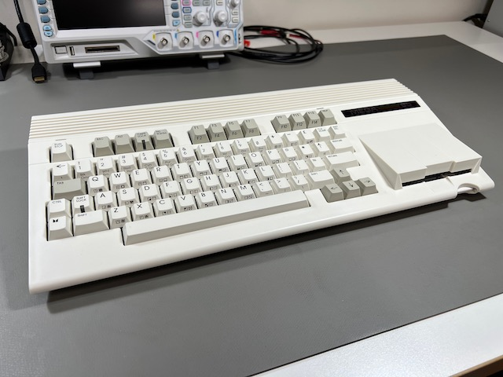
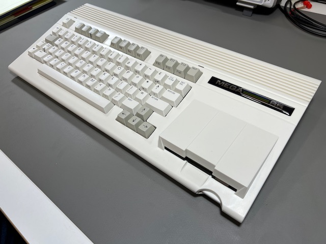

# Welcome!

Congratulations! You are the owner of [the MEGA65 personal computer](https://mega65.org/), a modern recreation of the [Commodore 65](https://en.wikipedia.org/wiki/Commodore_65). The Commodore 65 was the unreleased successor to the highest selling computer of all time, the [Commodore 64](https://en.wikipedia.org/wiki/Commodore_64).

```{tip}
Don't own a MEGA65? You can [pre-order one](https://shop.trenz-electronic.de/en/Products/MEGA65/) from the next batch!
```



Your MEGA65 comes with an excellent [User's Guide](https://files.mega65.org/manuals-upload/mega65-userguide.pdf) that describes the machine's features, including a command reference for its built-in BASIC programming language. This Welcome Guide 2022 is an unofficial supplement to the User's Guide, intended for new owners.

Specifically, this Welcome Guide will recommend first steps you can take to get the most out of your MEGA65 based on the hardware and software that was delivered in the year 2022. By following this guide, you will:

-   Explore your MEGA65 right out of the box!
-   Learn important concepts for maintaining your MEGA65
-   Prepare a microSD card for storage and software upgrades
-   Open your MEGA65 to install and upgrade components
-   Update your MEGA65 to the latest versions of the software
-   Learn about features still in development and known issues with the hardware
-   Find out how to learn more and connect with the MEGA65 community

This Welcome Guide will refer to the official User's Guide, so keep it handy!

## Why a Welcome Guide?

The MEGA65 is brought to you by the [MEGA Museum of Electronic Games & Art e.V.](https://www.m-e-g-a.org/), a registered voluntary association and non-profit organization. The core team of talented engineers and a community of contributors and patrons made this possible. They continue to improve and refine the capabilities of your upgradable machine.

This unofficial Welcome Guide describes the state of the MEGA65 as it was delivered in the first manufacturing run (batch #1) in the year 2022, including issues that may be fixed in later hardware batches and software updates. The Guide intends to smooth out the experience for new owners of early versions of the hardware and software. It is based on the author's own experiences and discussions among new owners troubleshooting common issues.

This is meant to be a _short-lived_ living document. Eventually, official documentation updates and future manufacturing runs will make this Guide obsolete. If you're one of the first people to purchase a MEGA65, this Guide will help you get up and running.

If you notice anything in this guide that needs updating, or if you discover a topic not covered by the official manual that you feel new owners should know about, please [report an issue](https://github.com/dansanderson/mega65-welcome-guide/issues), [email me](mailto:contact@dansanderson.com) (I'm Dan), or DM dddaaannn#7325 in [the MEGA65 Discord](https://discord.gg/5DNvESf). Thank you!


