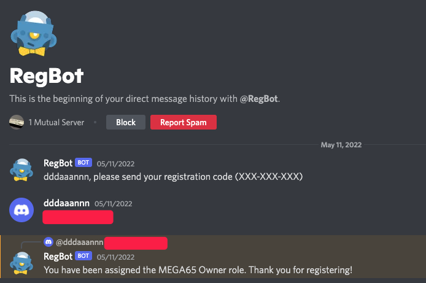

# Joining the community

Your fellow MEGA65 owners hang out together online. Come join us!

[The official MEGA65 support forum](https://www.forum64.de/index.php?board/457-mega65/&l=2) is a traditional web forum for discussions and searchable post history. Note that the account system for the forum is separate from the Filehost, so you will need to register a new account to participate.

For real-time chat, the action is in [the official MEGA65 Discord server](https://discord.com/invite/5DNvESf). Join with your Discord account and app.

Once you are on the Discord server, you can register yourself as a proud MEGA65 owner. This changes your username color to blue, and may potentially have other benefits in the future, such as owner-specific rooms.

To register your ownership role on Discord, go to the `#mega65` channel and say `!register`. (Yes, they want us to say this publicly in front of everybody. Be proud.) The `@RegBot` automated account ("BOT") will see your request and send you a direct message asking for your registration code. Reply with your nine-character registration code from that piece of paper. RegBot will assign you the ownership role and change your username color.



```{caution}
Be careful to only reply to RegBot. Don't post your registration code in a public channel, and don't reply to anyone pretending to be RegBot. Look for the "BOT" icon next to RegBot's name.
```
