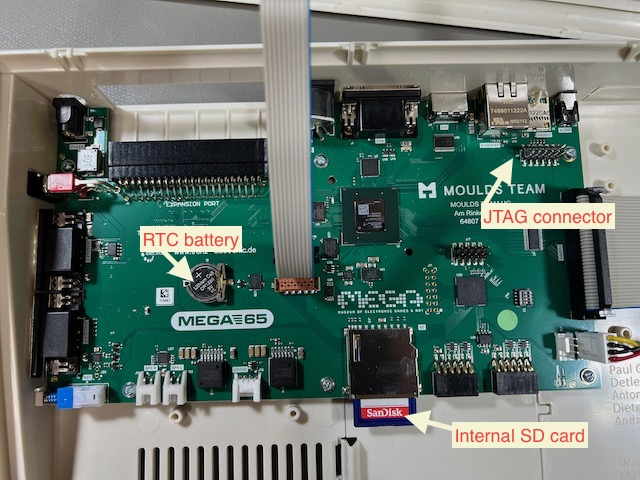

# Opening the MEGA65 case

Your MEGA65 consists of an injection molded plastic case, built-in keyboard and disk drive, ports for peripherals, and internal components. The case is designed to be opened by its owner if needed.

You may want to open the case for the following reasons:

- To access the internal SD card
  - There is a small door in the bottom of the case that provides access to the internal SD card without opening the case, but I find it too difficult to access this way. You will only need the internal SD card during initial set-up (see below), and only if you want to copy the bundled disk images.
- To install (or replace) the CR1220 battery for the Real-Time Clock
- To resolve issues with the case by adjusting its assembly (see {ref}`hardware-issues:known hardware issues`)
- To install a JTAG adapter (see {ref}`using-jtag:using the jtag connector`)

To open the MEGA65 case, locate three screws along the bottom front of the case and remove them with a Phillips head screwdriver.


The case separates into a top piece and a bottom piece. The keyboard is attached to the top, while the disk drive, ports, and main board are attached to the bottom. The keyboard is connected to the main board with a ribbon cable.





Install the CR1220 battery. Locate the battery holder on the main board. Insert the battery under the tab, with the positive (`+`) side facing upward. Push down to secure it.

```{tip}
See [Install battery CR1220 in MEGA65 for Real-Time Clock (RTC)](https://files.mega65.org?ar=14d5ca1e-bc16-45d4-83f5-41b0a0545e0d) for more photos and instructions.
```

Remove the full-size SD card from the internal slot. Connect it to your PC with an SD card reader. On your PC, copy all of the files to a folder for safe keeping. Eject the device from your PC, then return the card to the MEGA65's internal slot.

```{tip}
Leaving the internal card installed in its factory state is just one option. Alternatively, you can use the internal card as your primary card, removing it from the MEGA65 every time you need to use it with your PC. Or, you can leave the internal slot empty. MEGA65 only needs a memory card in one of the two slots.
```

```{tip}
You can always create a new working SD card directly from the MEGA65—though it won't include all of the bundled disk images. I recommend backing up the contents to your PC, leaving the card installed, and using the external microSD card slot for regular operation.
```

To close the case, align the plastic tabs along the back of the top and bottom case parts, then replace the three screws.
