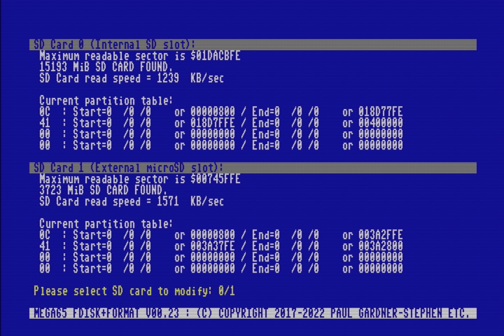
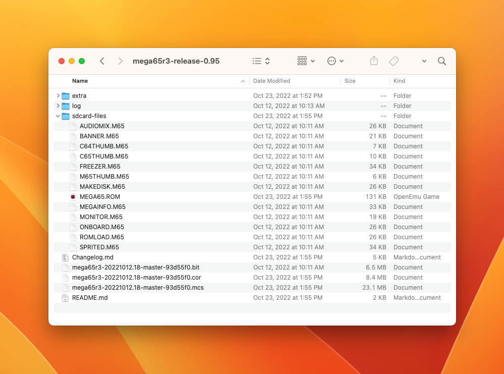

# Setting up the microSD card

Your microSD card will be your MEGA65's primary storage, and the primary way to transfer files to and from your PC. You will use it to update the firmware and store updated system software and ROMs. You will also use it to manage D81 disk images and store applications you have downloaded.

## Preparing the microSD memory card

To use an SD card with the MEGA65, it must be formatted (erased and prepared) using the MEGA65. The SD card works like a regular storage drive when connected to your PC, but it contains additional data not visible to the PC that is used by MEGA65.

To prepare a new microSD card for use, insert it into your MEGA65's external microSD card slot. Turn off your MEGA65, then hold the <kbd>Alt</kbd> key (top row near the left) and turn it on. Select option 2: SDCard FDisk+Format Utility (press <kbd>2</kbd>).


The SD card utility will look for cards in the available slots. Confirm that it has detected your microSD card correctly, then select option 1 for the external microSD slot (press <kbd>1</kbd>).

```{caution}
The SD card utility will erase the internal SD card if you ask it to. Be careful to select the correct card.
```



If prompted to do so, type the confirmation message, `DELETE EVERYTHING`, then press <kbd>Return</kbd>. Be sure to use uppercase (shifted) letters. The MEGA65 formats the SD card, erasing all of its data.

If prompted to "Populate SD card," **press <kbd>S</kbd> to skip**. We will copy these files from your PC in the next step.

```{hint}
For more on preparing SD cards for use, see the User's Manual, starting page 23. Note that the SD card utility has been improved in newer versions of the firmware since the manual was printed.
```

## Installing the SD card files

When told to do so by the MEGA65, remove the microSD card from the MEGA65, then insert it into your PC's microSD card reader. Locate the card's folder on your computer and open it. It should appear to be empty.

```{note}
If the microSD card is not empty, either you populated the card on the MEGA65 after formatting, or you may be trying to upgrade an already populated card. See {ref}`setting-up-microsd-card:upgrading from a previous version`, below.
```

Visit [the Filehost website](https://files.mega65.org/html/main.php). Make sure you are signed in and have registered your owner code with your account (see {ref}`accessing-filehost:accessing the mega65 filehost`).

Download [**MEGA65 Core Release Package (mega65r3) incl. ROM**](https://files.mega65.org?id=a0276005-e71c-4b2d-8d17-2aa92e492c50). (This is only visible to registered owners.)

This retrieves a file named `mega65r3-release-0.95-93d55f0.7z` (release bundle 0.95; see {ref}`determining-versions:bundled releases`). This file is in the [7z archive format](https://en.wikipedia.org/wiki/7z), and needs to be unpacked. If you're using macOS, double-click on this file to unpack it. Alternatively, you download and install [The Unarchiver](https://theunarchiver.com/), a utility which has a graphical app for macOS and a command-line tool for macOS, Windows, and Linux. Windows users might prefer [7-Zip](https://www.7-zip.org/).



Open the unpacked folder. Locate the file `mega65r3-20221012.18-master-93d55f0.cor`. (There are three files with similar long names; you want the `.cor` file.) **Rename this** to `r3r095.cor`, then copy it to the microSD card.

Open the `sdcard-files` sub-folder. Copy all files from this sub-folder to the root of the microSD card.

## Optional: reinstalling bundled software

The 0.95 release package does not include the bundled software that came on the full-size SD card installed at the factory, such as the demo disk or GEOS. You may wish to copy these files onto the microSD card. (The MEGA65 cannot access the internal full-size SD card when the microSD card is installed.)

If you haven't already, open the MEGA65 case (see {ref}`opening-the-case:opening the mega65 case`), and remove the full-size SD card from the internal slot. Insert it into your PC's card reader. Locate all of the `.D81` and `.MOD` files, and copy them to your PC. Eject the full-size SD card, replace it in the MEGA65 internal slot, then close the case.

Copy the `.D81` and `.MOD` files from your PC to the microSD card.

### Using the SD card image file

If you erased your factory-installed SD card without backing up its contents, you can find the [MEGA65 Release SD Card - Intro Disk](https://files.mega65.org?id=f588fd55-f2b8-4ca0-b5f4-9ae5b1c2e914) on Filehost. You must be a registered owner to see this file, because it contains licensed software including the ROM and GEOS.

This is a `.IMG` file. On macOS, you can double-click this file to open it and access the files inside. Alternatively, you can use a program like [Balena Etcher](https://www.balena.io/etcher/) to restore your full-sized SD card from inside the MEGA65. (This overwrites the SD card contents.) Proceed to copy the `.D81` and `.MOD` files from the disk image (or rewritten SD card) to the microSD card.

As of this writing, this image contains the release 0.9 / batch #1 version of the system software and ROM, so I don't recommend using the complete image unless you're recreating that configuration. The demo disk (`MEGA65.D81`) is also an older version. If you have a batch #2 MEGA65 and your internal SD card is intact, I recommend copying the bundled software from there, as described above.

## Installing the microSD card and re-running configuration

Eject the microSD card from your PC, then return it to the microSD card slot on the MEGA65.

The MEGA65 stores its settings on a hidden partition of the SD card. If you changed settings earlier, you will need to set them again in the Configuration utility with the newly prepared card installed. Hold the <kbd>Alt</kbd> key and turn on the MEGA65, then select <kbd>1</kbd> to configure your MEGA65.

## Upgrading from a previous version

If you already have an earlier version of the core, ROM, and system software on your microSD card, you can use the files in the [0.95 release bundle (with ROM)](https://files.mega65.org?id=a0276005-e71c-4b2d-8d17-2aa92e492c50) to upgrade without formatting the entire card.

There's one catch. Due to limitations of the MEGA65's SD card driver, it is important that you not simply replace the old files with the new ones on the microSD card using your PC. Under some circumstances, this can result in _fragmentation_ of a file, where the file is stored in discontiguous blocks. Modern computers can handle such files, but the MEGA65 can't.

To replace the system files while avoiding fragmentation, **delete the files from the microSD card first,** then copy the new files onto it. Some people recommend renaming the files before deleting them; I don't understand that step, but take it as further warning.

I wrote [a Python script](https://github.com/dansanderson/mega65-welcome-guide/blob/main/update-sd-card.py) that updates an SD card from a release package using this technique for all files to avoid fragmentation. Feel free to adapt it for your purposes.

[This article](https://files.mega65.org?ar=73fd7977-aad3-4e13-8b5a-e9f0548b6cb2) recommends using defragmentation tools on the SD card. I have not tested these.

```{tip}
This is true for all files on the SD card, including `.D81` disk images. To replace a file on the SD card using your PC, delete it, then copy it fresh.
```
