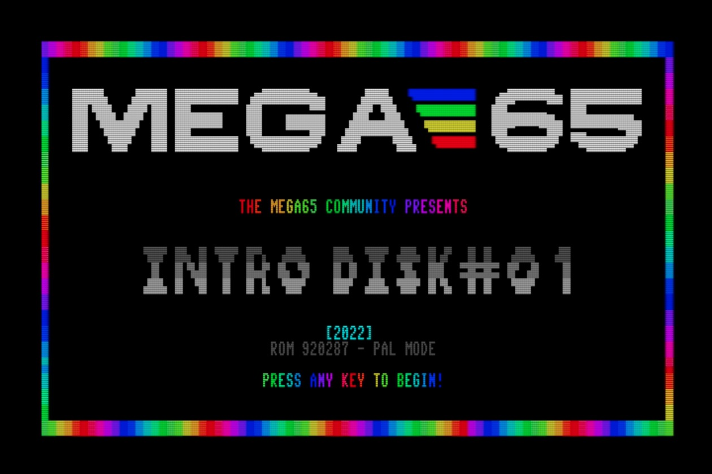

# Try this first!

You don't want to read stuff, you want to play with your new MEGA65! Well good news, there's _tons_ to play with, without ever having to download a file or crack open the case.

The fun is in the digging, so if you're ready to go, stop reading now and dive in. Come back to this section for some things to try before going further. Have fun!

## Connecting peripherals

Your MEGA65 only needs to be connected to its power supply (included) and a monitor (not included) to operate. The MEGA65 has two connectors for monitors: a VGA connector, and an HDMI connector. Both connections work simultaneously, showing the same display.

```{note}
See {ref}`video-display-compatibility:video display compatibility` later in this Guide for some notes on monitors.
```

The MEGA65 has two methods of producing sound: over the HDMI connection, or through the dedicated audio jack. You can connect headphones or speakers to the audio jack.

If you own a classic joystick, gamepad, or mouse with a [DE-9 nine-pin connector](http://wiki.icomp.de/wiki/DB9-Joystick), you can connect it to one of two nine-pin ports on the lefthand side of the machine. The MEGA65 supports both the [Commodore 1351](https://en.wikipedia.org/wiki/Commodore_1351) mouse and the Amiga mouse. The Amiga mouse requires setting a configuration option. Modern mouse replacements such as [the mouSTer adapter](https://retrohax.net/shop/amiga/mouster/) or the upcoming [wireless Amiga tank mouse](https://www.kickstarter.com/projects/lukas-remis/tank-mouse-your-new-amiga-mouse) are expected to work. Personally, I use a 1351 mouse in port 1 and a [modern Commodore-compatible gamepad](https://www.etsy.com/listing/681983120/commodore-64-atari-2600-controller) in port 2.

```{note}
Before connecting a mouse, be sure to set the mouse mode in the configuration step, described later. If an Amiga mouse is connected while the port is in the wrong mode, it may interfere with the behavior of the keyboard.
```

```{note}
Do not connect a Sega Genesis game controller directly to the MEGA65 or Commodore computers. Sega Genesis controllers are not compatible and may damage the computer, even though they have the same connector. If you wish to use the Genesis controller, you can use an adapter such as [the BackBit GenAssister](https://store.backbit.io/product/genassister/).
```

```{tip}
For more information on the peripheral ports, see the User's Guide, page 3.
```

## On-boarding

When you turn your MEGA65 on for the first time, it prompts you for some initial settings. The most important setting is the video mode. Use the <kbd>Tab</kbd> key to cycle between digital video without sound over HDMI vs. with sound over HDMI ("enhanced"), and PAL 50Hz vs. NTSC 60Hz display modes. Press <kbd>Space</kbd> to test a video setting to make sure it works with your monitor.

```{note}
If your display isn't working, you may need to adjust the video mode blindly until you find one that works. Older DVI monitors need the "without sound" mode, and monitors vary in their support for 50Hz and 60Hz refresh rates. Use the <kbd>Tab</kbd> and <kbd>Space</kbd> keys to try the different modes.
```

Take this opportunity to test your audio set-up. Press the <kbd>A</kbd> key to play a musical tone. If you are using audio over HDMI, make sure the video mode is set to "Enhanced (with sound)."

The "CRT emulation" option is a fun choice when using a modern flat panel display: it adds vertical gaps between pixels to simulate the CRT raster line. Try it to see if you like it: press the <kbd>C</kbd> key to toggle it on and off.

You can ignore the "Time" setting for now. We will discuss the Real-Time Clock later in this guide. All of these settings can be adjusted later.

```{tip}
For a description of the on-boarding interface, see the User's Guide, page 28.
```

## The reset button

As you try out the software that comes bundled with your MEGA65, you will want to reset the machine often. Be sure to locate the reset button on the lefthand side. There are some cases where you will need to completely turn off the MEGA65 using the power switch then turn it on again, but most of the time the reset button does what you need.

## Demonstration menu

Your MEGA65 is configured to run a demonstration program when you turn on the machine. You can use this menu to launch games, utilities, and demos that show off the capabilities of the MEGA65. Try them out! Remember that you can use the reset button to start over.




You can exit from the menu to MEGA65 BASIC, the built-in programming and operating environment. This environment is similar to the Commodore 64 and 128, where you can give the computer commands, write programs in the BASIC programming language, and load and save programs.


```{tip}
The User's Guide does an excellent job describing the BASIC environment. See chapter 3, starting page 9.
```

The demonstration menu is itself a BASIC program. When you exit from the menu to BASIC, this program will still be in memory. You can use the `LIST` command to see its source code. If you want to clear memory to write a new program, use the `NEW` command before entering statements.

```
NEW
10 FOR X=1 TO 100
20 PRINT "MEGA65! ";
30 NEXT X
RUN
```

Once you have tried all of the demo programs, you will probably no longer want your MEGA65 to start the demonstration mode every time it turns on. Select the "Disable auto-boot" menu option to disable it. You can get back to this menu later by loading and running the program with these commands:

```
LOAD "MENU"
RUN
```

If you change your mind and want your MEGA65 to automatically load the demonstration menu when it turns on, use this command to restore this capability:

```
RENAME "MENU" TO "AUTOBOOT.C65"
```

## The Freeze menu

The MEGA65 spends most of its time behaving as a Commodore 65 computer would, either running a program or awaiting instructions in the BASIC environment. Your MEGA65 has additional features that were not part of the original C65 design. You can access many of these features from the Freeze menu.

To open the Freeze menu, hold the <kbd>Restore</kbd> key for a second or more, then release it. The MEGA65 will pause whatever it is doing, flicker the border color, then open the Freeze menu. Whatever program was running remains in memory and can be resumed by pressing the <kbd>F3</kbd> key from the Freeze menu. You can also abandon the running program and reset the MEGA65 by pressing <kbd>F5</kbd>.


```{note}
Does your Freeze menu appear too low on the screen? This is a bug in the version of the software that shipped with the first batch of MEGA65 computers. It is fixed in a newer version of the software. You will upgrade the software later in this Guide.

If you are experiencing this issue, you can complete this section of the Guide with the broken display, or you can skip this and return after you have installed the update in a later section.


```

There are many useful features in the Freeze menu. Try them out!

One feature to remember when playing games is the "(J)OY SWAP." This causes the two joystick ports to trade numbers. If you have a joystick in port 2 and you start a game that expects a joystick in port 1, instead of disconnecting and reconnecting the joystick, open the Freeze menu, press <kbd>J</kbd> to swap the port numbers, then resume your game.

```{note}
In the factory-installed version of the Freeze menu, it is possible—and undesireable—to freeze the Freeze menu by pressing <kbd>Restore</kbd> again while the Freeze menu is open. If you do this accidentally, reset and try again.
```

## Disk images

One of the MEGA65's most useful features is its virtual disk drive. Of course, you can use vintage 3-1/2" floppy disks with the MEGA65's built-in physical drive. More often, you will use files that represent disks ("disk images") that reside on a modern SD memory card. You can use the Freeze menu to tell MEGA65 whether to use the physical drive or a disk image file as a disk drive.

MEGA65 comes bundled with several disk images, including one named `MEGA65.D81` that contains the demonstration menu and all of the demo programs. You can make your own D81 disk images, and can download MEGA65 software as D81 disk image files over the Internet using your PC.

Try browsing one of the disk images included with your MEGA65:

1. If the Freeze menu is not already open, hold the <kbd>Restore</kbd> key for a second then release it.
2. Press <kbd>0</kbd> (zero) to see the options for setting up the first drive.
3. Use the cursor keys to navigate to `DEMOCOMP.D81`. Press <kbd>Return</kbd> to select it.
4. Notice that the disk image name appears under the "Internal drive" in the Freeze menu.
5. Press <kbd>F5</kbd> to reset with this disk image in the virtual drive.


```{tip}
If you are mounting a disk to start a new program, use the <kbd>F5</kbd> key to exit the Freeze menu with a reset. Your disk will continue to be mounted after the reset.

While it is tempting to use the <kbd>F3</kbd> key to "resume," exiting with reset is more likely to load new programs correctly. You only need to resume if you are swapping disks while a program is running.
```

```{tip}
The User's Guide describes disk images and the Freeze menu in chapter 7, starting page 59.
```

## Loading and running a program from disk

You now have the `DEMOCOMP.D81` disk image mounted to device 8 (drive 0). Let's see what's on the disk! Enter the following command at the BASIC `READY.` prompt:

```
DIR
```

This lists all of the files on the disk, also known as the _disk directory_.


You can use the `LOAD` command to load a program off of the disk by name:

```
LOAD "NOVDEMO"
```

If you've used a Commodore 64, you may remember having to type `,8` or `,8,1` after a `LOAD` command when loading from a disk drive. With MEGA65, unit 8 is the default, so this can be omitted.

Move the cursor to a blank line (or press <kbd>Shift</kbd> + <kbd>Clr Home</kbd> to clear the screen), then type `RUN` to start the `NOVDEMO` program.

```
RUN
```


```{tip}
A common trick you may remember from your Commodore 64 is, instead of typing the full filename of something you wish to `LOAD`, you can list the directory of the disk, then move the cursor up to the line with the name of the program and type `LOAD` at the beginning of the line to form the command.

This works on the MEGA65 too, but MEGA65 has a faster way: just type `/` (forward slash) at the beginning of the line, then press <kbd>Return</kbd>. Unlike with `LOAD`, you do not need to clear away the extra characters on the line for the `/` to work.


```

When you're done enjoying the demo, you can press the reset button, or use the Freeze menu and press <kbd>F5</kbd> to reset.

## Commodore 64 mode

Like the Commodore 65 on which it is based, the MEGA65 can run in a Commodore 64 compatibility mode. From BASIC, enter this command, then type `YES` to confirm:

```
GO 64
```


The Freeze menu is accessible when in C64 mode, and can be used to mount D81 disk images (or the physical disk drive) with disks containing C64 software.

MEGA65 includes a D81 disk image with C64 games and demos, named `C64.D81`. Use the Freeze menu to mount it to the first drive, then resume C64 mode. Use C64 commands to access the disk in unit 8.

```
LOAD "$",8
LIST
LOAD "DIGILOI",8
RUN
```

Some of the programs on the `C64.D81` disk only work with the PAL video setting. If your monitor supports it, change this setting in the Freeze menu.

```{note}
MEGA65 currently only supports D81 disk images. Support for the more common `D64` format that represents a Commodore 64 5-1/4" floppy disk may be added in a future update.

C64 mode is not to be confused with the C64 _core_, an alternate way to run C64 software on the MEGA65 which we will discuss later in this guide. The C64 core supports D64 disk images, in a different way.
```

```{tip}
For detailed information about C64 mode, see the User's Guide, chapter 5, starting page 39.
```

## Other bundled software

Don't miss the other D81 disk images included with the MEGA65:

-   `MEGA65.D81`: The original MEGA65 demo disk
-   `C64.D81`: A disk of C64 games and demos
-   `BASIC65.D81`: Example BASIC programs that demonstrate major BASIC commands, from the User's Guide
-   `DEMOCOMP.D81`: Winners of the Shallan MEGA65 demo competition
-   `ELEVEN.D81`: The Eleven programming environment, a modern update to MEGA65 BASIC with a powerful development environment
-   `GEOS65.D81`: A version of the GEOS graphical operating system for the MEGA65; use this with a mouse
-   `SOLITAIR.D81`: A Solitaire card game for the MEGA65; use this with a mouse

## Configuring your MEGA65

I mentioned that the settings from the on-boarding process can be adjusted later. These settings and more are available in the built-in configuration utility.

To start the configuration utility, turn off your MEGA65, then hold the <kbd>Alt</kbd> key (top row near the left) and turn it on. Select option 1: Configure MEGA65 (press <kbd>1</kbd>).


You can use the cursor keys or a mouse to navigate the configuration options. This is also a good way to test whether your mouse is working. Useful options include:

-   Input: mouse configuration. You can enable the use of Amiga mice on either port.
-   Chipset: Real-Time Clock. This is how you set the date and time, which I told you to skip during on-boarding because you haven't installed the battery yet.
-   Chipset: Default Disk Image. Specify a D81 filename to load by default when you turn on the computer.
-   Video: All of the video options from the on-boarding screen.

```{note}
The clock setting in the configuration utility uses the following time and date format: `HH:MM:SS YY/MM/DD` (That's hours, minutes, seconds, the year, the month, and the day of the month.) It doesn't prevent you from entering invalid numbers. Take care to use the correct date format.


```

Under "Done," you can save these settings as defaults. These settings are stored on the SD card, except for the Real-Time Clock which sets the clock hardware.
