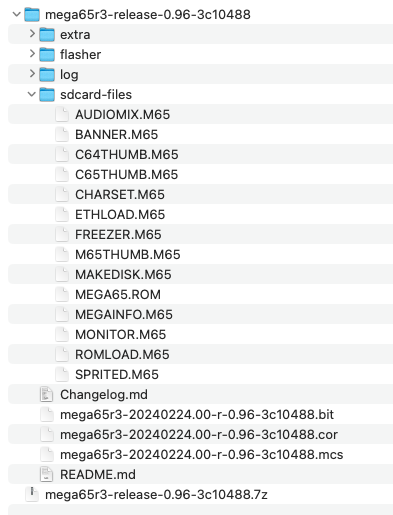
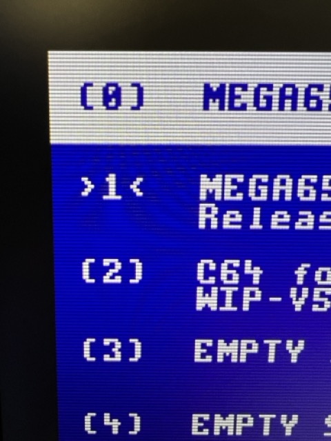

# Updating the core firmware

Your MEGA65 was shipped from the factory with the latest firmware (core) and system software available at that time. The MEGA65 project continues to make improvements to the platform, and a newer release may be available. It is recommended that you upgrade your MEGA65 to the latest stable version.

## Downloading the latest release package

As of February 2024, the latest stable release is v0.96.

Identify the hardware version of your MEGA65, either "R3" ("R3A" is the same in this case) or "R6". (See {ref}`determining-versions:determining the versions of things`.)

Visit [Filehost](https://files.mega65.org/) in a web browser, and make sure you are signed in with your owner account. You must be a registered owner to access the version of the release package containing the MEGA65 ROM.

Search or browse for "MEGA65 Core Release Package." You will see multiple options. Select the option for your hardware version ("mega65r3" or "mega65r6") that also says "with ROM." (If only options that say "no ROM" show up, make sure you are signed in.)

Click "Download." Your browser downloads a file in the `.z` archive format. Expand the archive. In the expanded folder, locate the `mega65....cor` file, and the `sdcard-files` sub-folder.



Copy the `.cor` file and the contents of the `sdcard-files` sub-folder to your MEGA65's SD card. Replace the `.M65` and `.ROM` files on the SD card with the files in `sdcard-files`. Eject the card, then re-install it in the MEGA65.

```{note}
The note about file fragmentation mentioned in {ref}`setting-up-microsd-card:a note about file fragmentation...` applies here. The safest way to replace the `.M65` and `.ROM` files on the SD card is to rename the old files (to any name), copy the new files onto the card, then delete the old ones. It's a pain, but it's just this once.

Once you have v0.96 installed, you'll be able to use Ethernet file transfer for this instead of moving the SD card, avoiding the fragmentation issue. Look forward to a brighter future!
```

## Upgrading to the v0.96 release

```{tip}
This Guide assumes you are upgrading to the v0.96 release. The core installation process has been improved in v0.96—but you have to upgrade to get the new experience. This Guide describes what you'll see when upgrading to v0.96 from either v0.9 or v0.95.
```

Make sure the MEGA65 is off, then hold the <kbd>No Scroll</kbd> key (in the top row) and turn it on. This opens the core selection and installation menu.


Core 0 is the factory-installed core. If this is your first time seeing the core selection menu, slots 1 through 7 should be empty. When you turn on your MEGA65 normally, it checks to see if slot 1 contains a core, and uses it if present. Otherwise it falls back to core 0. For now, you will put the new core you just downloaded in slot 1 for regular use.

Hold the <kbd>Ctrl</kbd> key and press <kbd>1</kbd>. Use the cursor keys to find the `.cor` file. When upgrading from an early version of the system software, this might appear as `mega65-1.cor` instead of its full filename. (Long filename support is new to v0.96.) Press <kbd>Return</kbd>, then press any key when prompted to install the core.


The flashing process takes a minute or so. When it is complete, you'll see the message, "Flash slot successfully updated," and the border will twinkle. Press any key to return to the core selection menu. Finally, press <kbd>1</kbd> (without <kbd>Ctrl</kbd>) to start the system with the new core.


```{note}
If you use a Mac computer to copy a file to a MEGA65 SD card, it creates another file with a name like `._filename` to store the macOS resource fork. This appears in the core file selection screen as the original name with a stripey thing next to it. Be sure to select the original core file, and not the one with the stripey thing, when installing a core.

If you select the wrong one, MEGA65 will warn that the incorrect file does not have a matching device ID (because it isn't a real core file). Press <kbd>RUN/STOP</kbd> to abort and try again with the correct file.
```

## Upgrading slot 0

Normally, I'd recommend leaving core slot 0 alone so that it contains the factory installed core, and just use slot 1 for everything. In fact, the core selection menu makes it extra difficult to upgrade slot 0 for this purpose.

With the v0.96 release, there is a reason to upgrade slot 0: slot 0 is what powers the boot process, the Configuration and SD card utilities, and the core selection menu itself. Release v0.96 makes the core flashing process more robust, including making updating slot 0 safer. In fact, the recommended way to upgrade v0.96 to slot 0 is to install it in slot 1, then re-launch the core flashing process from slot 1 to install it in slot 0.

Release v0.96 also adds a feature that can automatically select the C64 core when a C64 cartridge is installed, and implements a new protocol for MEGA65 cartridges for future use. You need release v0.96 in slot 0 to get these features.

With the v0.96 release in slot 1, switch off the computer, hold <kbd>No Scroll</kbd>, then switch it back on. This opens the slot 0 core selection menu, with your freshly installed v0.96 core in slot 1.

Prepare to hold <kbd>No Scroll</kbd> again, then quickly press <kbd>1</kbd> then hold <kbd>No Scroll</kbd>. If you're successful, the core selection menu opens again, but this time it's the *new version*. You can identify the new version by the distinctive angle-y things next to the "1": `>1<`



Now, press the secret keyboard command <kbd>Mega</kbd> + <kbd>,</kbd> (comma). Read the warning screen, then type `CONFIRM` using all capital letters, then press <kbd>Return</kbd>.

You are now looking at the new flashing procedure, with slot 0 selected. It looks different from the one you just used for slot 1, but it's just as easy. Press <kbd>F3</kbd>, then select the `.cor` file. With the file in the "Replace" box, press <kbd>F8</kbd> to flash. Watch the new animation!

When it says it's done, you can safely switch your computer off then on again. From now on, whenever you need the core selection menu or Configuration utility, it will use the new versions.

## The C64 core

I mentioned that the MEGA65 can run other cores besides the one that causes your MEGA to act like a Commodore 65. One such core is a Commodore 64.

The C64 core is _not the same_ as the C65's Commodore 64 mode, the one you start by typing `GO 64` (see {ref}`try-this-first:commodore 64 mode`). The C64 core completely transforms your MEGA into a Commodore 64, with no C65 or MEGA65 features. It strives to be as compatible as possible with C64 software. The current version supports PAL displays and timings, a simulated C1541 drive that supports D64 image files, and joysticks.

If you'd like to try the C64 core, go to Filehost, then locate and download "[C64 for MEGA65](https://files.mega65.org?id=896a012f-59e4-456c-b91f-7e989b958241)". Install it like you did the MEGA65 core update, using slot 2.

The C64 core has its own display configuration, separate from the MEGA65 core. It only supports PAL mode, and defaults to HDMI with audio. If your DVI display does not support audio, you may need to temporarily connect to a VGA monitor to change the setting. You can also follow [this recipe](https://github.com/MJoergen/C64MEGA65#hdmi-compatibility) to adjust these settings while not being able to see the screen. While the C64 core is running, press the <kbd>Help</kbd> key to open the menu, then cursor down to the video options and press <kbd>Return</kbd> to enable them, as needed.

The C64 core can read D64 image files off of the SD card. From the <kbd>Help</kbd> menu, press <kbd>Return</kbd> on the first line to browse the SD card, then select a disk image to mount to device 8. Press <kbd>Help</kbd> again to close the menu. The disk image you selected is now mounted, and you can execute C64 disk commands as usual (such as `LOAD "*",8,1`).


```{tip}
To avoid cluttering your SD card with D64 images, you can use your PC to create a folder named `c64` and put the D64 files in there. The C64 core will notice the folder and limit its browser to just these files.
```

See the [Commodore 64 for MEGA65 manual](https://github.com/MJoergen/C64MEGA65/blob/master/README.md) for more information.

To return to the MEGA65 core in slot 1, turn off the machine, then turn it on again.

```{tip}
For information on other cores that work with the MEGA65, see [What are "alternative" MEGA65 cores?](https://sy2002.github.io/m65cores/). You can use alternate cores to convert your MEGA65 into a [ZX Spectrum](https://files.mega65.org?id=bdaeb7e0-9fc8-4185-99de-104d01229f27) or a [Game Boy Color](https://files.mega65.org/html/main.php?id=03b68172-d6ff-49f0-971e-15bea2c6ad9a)!
```
