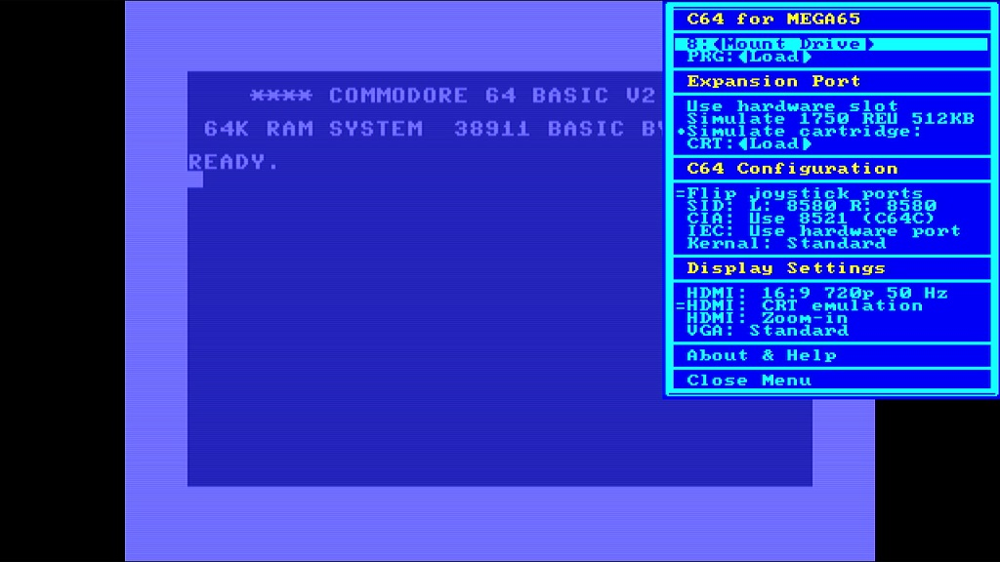

# Updating the core firmware

In the previous step, {ref}`setting-up-microsd-card:installing the sd card files`, you copied the release 0.95 core file to the SD card (which we renamed `r3r095.cor`). If you received your MEGA65 in early 2022, you should upgrade to this new version.

If you received your MEGA65 in late 2022 or early 2023, you already have the release 0.95 core as the factory-installed core (slot 0), and you do not need to upgrade. Skim this section for advice on how to manage cores, for future reference.

## Installing the MEGA65 core

Make sure the MEGA65 is off, then hold the <kbd>No Scroll</kbd> key (in the top row) and turn it on. This opens the core selection and installation menu.


Core 0 is always the factory-installed core and cannot be overwritten. This can help you restore your MEGA65 to a working state if something goes wrong with updating a core. If this is your first time seeing the core selection menu, slots 1 through 7 should be empty.

When you turn on your MEGA65 normally, it checks to see if slot 1 contains a core, and uses it if present. Otherwise it falls back to core 0. You will put the new core you just downloaded in slot 1 for regular use.

Hold the <kbd>Ctrl</kbd> key and press <kbd>1</kbd>. Use the cursor keys to find `r3r095.cor`. (If you didn't rename it to use a shorter name, it may appear as something like "`mega65-1.cor`".) If there is a second one with a stripey thing next to it, select the one _without_ the stripey thing. Press <kbd>Return</kbd>, then press any key when prompted to install the core.


The flashing process takes a minute or so. When it is complete, you'll see the message, "Flash slot successfully updated," and the border will twinkle. Press any key to return to the core selection menu. Finally, press <kbd>1</kbd> (without <kbd>Ctrl</kbd>) to start the system with the new core.


```{note}
If you use a Mac computer to copy a file to a MEGA65 SD card, it creates another file with a name like `._filename` to store the macOS resource fork. This appears in the core file selection screen as the original name with a stripey thing next to it. Be sure to select the original core file, and not the one with the stripey thing, when installing a core.

If you select the wrong one, MEGA65 will warn that the incorrect file does not have a matching device ID (because it isn't a real core file). Press <kbd>RUN/STOP</kbd> to abort and try again with the correct file.
```

```{hint}
For more on installing cores, see the User's Guide, chapter 6, starting page 47.
```

## Symptoms that you're using the wrong MEGA65 core

If you've been following along with this Guide, you should now have a MEGA65 that uses the latest core and ROM when you turn it on. You can confirm the core and ROM versions as described in {ref}`determining-versions:determining the versions of things`.

Some actions, such as accessing the Configuration or SD card utility from the <kbd>Alt</kbd> menu, cause the MEGA65 to boot into its factory core (slot 0) instead of the updated core in slot 1. This can cause issues with the older core to reappear, or for the newer ROM to interact poorly with the older core.

I noticed a few common symptoms caused by older versions of the ROM, the core, or a version mismatch:

-   _The Freeze menu appears too low on the screen, obscuring the bottom._
    -   You have an older ROM, or an older version of `FREEZER.M65`.
-   _The Freeze menu does not display the name of the selected D81 file next to the drive, and the disk does not mount properly._
    -   You are using the newer ROM with the older core.
-   _Disk directory misbehavior, such as an extra file, or missing files._
    -   You are using the newer ROM with the older core.

Use "Matrix mode" (hold <kbd>Mega</kbd>, hit <kbd>Tab</kbd>) to double check that MEGA65 is using the latest core. If it is using the factory core (`1586ad4`) and you have a newer core installed in slot 1, turn off your MEGA65, then turn it back on.

## The C64 core

We mentioned that the MEGA65 can run other cores besides the one that causes your MEGA to act like a Commodore 65. One such core is a Commodore 64.

The C64 core is _not the same_ as the C65's Commodore 64 mode, the one you start by typing `GO 64` (see {ref}`try-this-first:commodore 64 mode`). The C64 core completely transforms your MEGA into a Commodore 64, with no C65 or MEGA65 features. It strives to be as compatible as possible with C64 software. The current version supports PAL displays and timings, a simulated C1541 drive that supports D64 image files, and joysticks.

If you'd like to try the C64 core, go to Filehost, then locate and download "[C64 for MEGA65](https://files.mega65.org?id=896a012f-59e4-456c-b91f-7e989b958241)". Install it like you did the MEGA65 core update, using slot 2.

The C64 core has its own display configuration, separate from the MEGA65 core. It only supports PAL mode, and defaults to HDMI with audio. If your DVI display does not support audio, you may need to temporarily connect to a VGA monitor to change the setting. While the C64 core is running, press the <kbd>Help</kbd> key to open the menu, then cursor down to the video options and press <kbd>Return</kbd> to enable them, as needed.

The C64 core can read D64 image files off of the SD card. From the <kbd>Help</kbd> menu, press <kbd>Return</kbd> on the first line to browse the SD card, then select a disk image to mount to device 8. Press <kbd>Help</kbd> again to close the menu. The disk image you selected is now mounted, and you can execute C64 disk commands as usual (such as `LOAD "*",8,1`).



```{tip}
To avoid cluttering your SD card with D64 images, you can use your PC to create a folder named `c64` and put the D64 files in there. The C64 core will notice the folder and limit its browser to just these files.
```

See the [Commodore 64 for MEGA65 manual](https://github.com/MJoergen/C64MEGA65/blob/V1/README.md) for more information.

To return to the MEGA65 core in slot 1, turn off the machine, then turn it on again.

```{tip}
For information on other cores that work with the MEGA65, see [What are "alternative" MEGA65 cores?](https://sy2002.github.io/m65cores/). You can use alternate cores to convert your MEGA65 into a [ZX Spectrum](https://files.mega65.org?id=bdaeb7e0-9fc8-4185-99de-104d01229f27) or a [Game Boy Color](https://files.mega65.org/html/main.php?id=03b68172-d6ff-49f0-971e-15bea2c6ad9a)!
```
