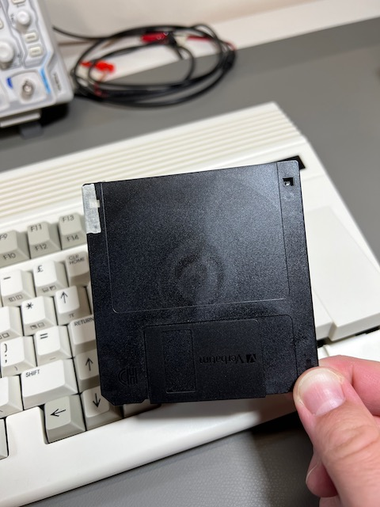

# Using disks

We discussed using D81 disk images back in {ref}`try-this-first:disk images`, including:

- How to browse D81 disk images using the Freeze menu
- How to mount a D81 disk image on drive 0 device 8 using the Freeze menu
- How to get a directory listing with the `DIR` command
- How to load and run a program on the disk using the `LOAD` and `RUN` commands
- How to use the `/` shortcut to load a file within a directory listing

Disk-related improvements have been advancing quickly, and the latest ROM includes bug fixes and useful features not mentioned in the printed manual.

```{tip}
Be sure that you have the latest ROM version before trying some of these features.
```

## Listing a disk directory

The `DIR` command lists all of the files on a given disk. Without arguments, it lists the files on the disk in device 8:

```
DIR
```

If there are too many files than fit on a single screen, the list will scroll off and you will only see the bottom of the list. You can use the `W` argument to tell `DIR` to show the listing in multiple columns, and to wait for a keypress to show more pages. (Try this with the `MEGA65.D81` disk.)

```
DIR W
```

```{tip}
For more on the `DIR` command, see the User's Guide, page 106.
```

One disadvantage of the `W` flag is that you cannot use the `/` shortcut to load a program into memory. There is another way to view the complete directory listing and still use this shortcut: load the listing into BASIC memory. Commodore 64 users are familiar with `LOAD "$",8` followed by `LIST`. To do this with the MEGA65:

```
DLOAD "$$"
LIST
```

This still scrolls a long listing off the screen, but now you can use MEGA65 BASIC's listing viewer features to scroll up to previous lines. Use the F9 and F11 keys to traverse the listing, then cursor up to a program you want to load and use the `/` shortcut.

```{caution}
Loading the directory listing with `DLOAD` overwrites any BASIC program that resides in memory. The `DIR` command does not overwrite BASIC memory.
```

## Using the SD card from BASIC

Recent improvements added the ability to manipulate disk images on the SD card without using the Freeze menu. In general, device `U12` is considered the SD card. Only some disk commands work with the `U12` device.

To list all of the files on the SD card:

```
DIR U12
```

This does not yet support other features of the `DIR` command, such as filters or paging.

To mount a D81 disk image from the SD card directly from BASIC, use the `MOUNT` command:

```
MOUNT "DISKNAME.D81"
```

By default, this mounts the disk image to device 8 (`U8`). To mount to device 9, add an argument:

```
MOUNT "DISKNAME.D81",U9
```

You can load a program file (`.PRG`) directly from the SD card, without having to create a D81 disk image. To do this, use the `DLOAD` command with unit `U12`, and be sure to include the `.PRG` filename extension:

```
DLOAD "FILENAME.PRG",U12
```

(Loading a PRG file directly from the SD card does not work with the `LOAD` command.)

## Using 3-1/2" floppy disks

Your MEGA65 includes a built-in 3-1/2" floppy disk drive for a complete retro experience.

If you don't have 3-1/2" floppy disks lying around, you can still buy them new-old-stock at a reasonable price. I buy mine from [FloppyDisk.com](https://www.floppydisk.com/). You can also find refurbished floppy disks on [eBay](https://www.ebay.com/).

The MEGA65 floppy drive supports both double density (DD) and high density (HD) disks. _However,_ as of this writing, the ability to use the larger capacity of HD disks is still in development. To use an HD disk with the MEGA65, you must apply non-transparent tape over the hole in the upper left (as shown). This convinces the floppy drive to treat the HD disk as if it were DD.



```{tip}
Until this is fixed in a future software update, an HD disk with the hole exposed will not work with the MEGA65. If your disk isn't working, double-check that the hole is covered.
```

Using the physical floppy drive is similar to using a disk image. Open the Freeze menu (hold Restore, then release), then select drive number `0`. (The internal drive can only be mounted to drive 0.) In the list of options that includes the D81 disk images, select `- INTERNAL 3.5" -`. Exit the Freeze menu (resume or reset).

Insert a floppy disk in the drive. If you have not used this disk with the MEGA65 before, it needs to be formatted. This erases all data on the disk! Use the `HEADER` command, providing a disk name in quotes, and a two digit disk ID number preceded by the letter `I`:

```
HEADER "WORK FILES",I01
```

Enter `YES` at the prompt to confirm. Formatting a disk for the first time takes a minute or so.

```{tip}
See the `HEADER` command in the User's Guide, page 135.
```

You can now use the floppy disk like you would a D81 disk image. Some things to try:

```
DIR

10 PRINT "HARD AT WORK"
20 GOTO 10
SAVE "HARDLYWORKING"

NEW
DIR
LOAD "HARDLYWORKING"
LIST
RUN
```

## Using an external disk drive

Your MEGA65 has a 6-pin IEC serial port for connecting vintage Commodore disk drives. With a drive connected, you can use the Freeze menu to assign it to drive `1`.

Commodore disk drives use a serial protocol that allows multiple devices to be connected in a chain. Each device must have a unique device ID. For disks, the available device IDs are 8, 9, 10, or 11. These old devices do not have a way to figure out their device IDs automatically. Instead, you use switches on the device itself to tell the drive its device ID. Each device ID must be assigned to a unique drive.

The MEGA65 can assign either device ID 8 or 10 to the drive connected as drive 0 (a disk image or the internal floppy drive), and can assign either device ID 9 or 11 to the drive connected as drive 1 (another disk image or the external serial port). You can toggle the device IDs for drive 0 or 1 in the Freeze menu by pressing `8` or `9`, respectively. Make sure your external drive is configured to use the device ID you have assigned to drive 1 in the MEGA65 Freeze menu (either 9 or 11).

Any device that supports the disk serial protocol is expected to work, including new disk devices such as the [Pi1541](https://cbm-pi1541.firebaseapp.com/). Notice that some such devices like the SD2IEC need the C64 tape port to supply power to the device, and the MEGA65 has no such port.

## Converting a D64 to a D81

You can find almost every game and application written for the Commodore 64 online in the form of disk images. However, these disk images are typically in the D64 format, which represents a 5-1/4" floppy disk. If you want to try running a C64 application on your Mega65 in its C64 mode, you must first convert the D64 image to a D81 image. (The D81 image represents a 3-1/2" floppy disk.)

One way to do this is with the `cbmconvert` command line tool. This requires your PC (Windows, Mac, or Linux) and familiarity with the command line (Terminal).

`cbmconvert` is only available as source code, so you will need the ability to compile software on your PC. Linux users typically already have compilation tools installed. Mac users can install such tools with the command:

```
xcode-select --install
```

To build the `cbmconvert` tool:

1. [Download cbmconvert-2.1.2.tar.gz](http://www.zimmers.net/anonftp/pub/cbm/crossplatform/converters/unix/cbmconvert-2.1.2.tar.gz). (See [the download site](http://www.zimmers.net/anonftp/pub/cbm/crossplatform/converters/unix/) for links to other versions.)
2. Expand the archive: `tar xvfz cbmconvert-2.1.2.tar.gz`
3. Change to the expanded directory: `cd cbmconvert-2.1.2`
4. Build the tool: `make -f Makefile.unix`
   1. Windows users with a POSIX-compliant build environment, use `make -f Makefile.win32`

The `cbmconvert` tool is now present in the directory. You can put this directory on your command path, copy the `cbmconvert` file to somewhere on your path, or use the path to this directory when running the tool.

To use `cbmconvert` to convert a D64 file to a D81 file:

```
cbmconvert -v2 -d filename.d64 -D8 filename.d81
```

Copy the new D81 file to your microSD card, then return the card to your MEGA65. Open the Freeze menu, then select the D81 image for drive 8. At the MEGA65 BASIC prompt, enter `GO 64` and type `YES` to confirm. The disk is now available on drive 8 from C64 mode.

```{note}
Not all D64 disks can be converted to D81, especially software with copy protection.
```

```{note}
C64 mode is known to not be compatible with all C64 software. If you are experiencing difficulty, try using the Freeze menu to switch from NTSC to PAL video mode or vice-versa (assuming you have a monitor that can show it).
```

```{tip}
Remember that the C64 core (not C64 mode) supports D64 disk images directly without needing to convert them to D81 images. See {ref}`updating-core:the c64 core`.
```
