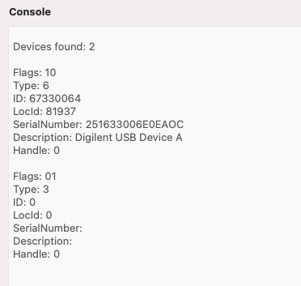

# Using the JTAG connector

The MEGA65 main board has a 12-pin [JTAG](https://en.wikipedia.org/wiki/JTAG) connector, a standard for connecting test equipment to devices. It is not intended for regular users of a device—but we MEGA65 owners are not regular users, are we?

With a JTAG USB adapter and software available on Filehost, you can connect your PC directly to the main board to:

-   Upload and execute programs being cross-developed on a PC
-   Transfer files between your PC and MEGA65 without removing the SD card
-   Perform remote debugging on programs and the built-in MEGA65 utilities
-   Upload ROMs and cores for testing
-   Use your MEGA65 as a SID music player (!)

The MEGA65 does not have a user-accessible port for the JTAG connection. You will have to acquire a JTAG USB adapter and a mini-USB cable, install it, and run the cable out the back of the MEGA65 case.

```{tip}
You can also use a more common USB UART adapter for most of the purposes described below (sending files and commands). The adapter _must_ output 3.3 volts, _not_ 5 volts. Test your adapter with a volt meter before using. See [Use of an USB UART adapter as alternative to a JTAG adapter](https://files.mega65.org/html/main.php?ar=f9e8436a-169d-42cb-8274-70d49b6096ba) for instructions on how to wire a UART to the JTAG connector pins. See also [this article by RetroCombs](https://www.retrocombs.com/mega65-usb-ttl).

Photos below show how to connect the TE0790-03 JTAG adapter.
```

```{tip}
For another version of these instructions with more photos, see [JTAG adapter, how to plug and DIP switch settings](https://files.mega65.org?ar=3c388c8c-bc3f-461b-84bb-e12dfd479ae2).
```

## Acquiring a JTAG adapter

The [XMOD FTDI JTAG Adapter
TE0790-03L](https://shop.trenz-electronic.de/en/TE0790-03L-XMOD-FTDI-JTAG-Adapter-not-compatible-with-Xilinx-Tools)
(Trenz Electronic) is compatible with the MEGA65. (The
[TE0790-03](https://shop.trenz-electronic.de/en/TE0790-03-XMOD-FTDI-JTAG-Adapter-Xilinx-compatible)
is the same part with a Xilinx license, which you do not need to use MEGA65 tools.) You might also be able to
[order the TE0790-03 from
DigiKey](https://www.digikey.com/en/products/detail/TE0790-03/1686-1180-ND/10071026).
As of this writing, this item is difficult to get due to supply chain issues.
Trenz is accepting backorders (even though "in stock" says zero) and will be
fulfilling them as parts become available.


## Installing the JTAG adapter

You will have to open the MEGA65 case to connect the adapter to the 12-pin JTAG connector on the main board, in the back right corner. (See {ref}`opening-the-case:opening the mega65 case` for an annotated photo of the main board.) The adapter connects with the mini-USB connector facing to the right.


Use a pin or a small screwdriver to set the DIP switches on the connector to left, right, right, left, as shown. This configures the adapter to draw power from the USB connection. (Other documentation suggests left, right, left, right, which draws power from the MEGA65. The USB setting worked fine for me.)


Connect a mini-USB cable to the JTAG connector, and run the cable out the back of the MEGA65 case. You can feed it out the cartridge port (potentially blocking access to the port), or punch out one of the unused port covers in the back case. Connect the other end to your PC.

I used a [Mini USB panel mount cable](https://www.amazon.com/gp/product/B08RSBCN66/) (30 cm/12 in, right-angled) to extend the mini-USB jack to the back of the case, then punched out one of the unused holes for it with a utility knife. The mount cable includes a washer and nut to hold firmly to the 17 mm hole. I then connect it to my PC with a standard USB Mini B Male to USB A Male cable.


```{tip}
[This Ribu mini USB panel socket](https://www.ribu.at/mini-usb-2-0-einbaubuchse-mit-verlaengerungskabel-m14) has a nice metal mount and is more flush with the case than the plastic mount I used. It needs an additional washer to avoid falling into the case.
```

## Using M65Connect

The M65Connect app is a useful multitool that takes advantage of the JTAG connection.

### Setting up

Download the M65Connect app for [Windows](https://files.mega65.org?id=d612d745-360e-4e86-8e15-14af525b6220), [Mac](https://files.mega65.org?id=5919a8b8-c23c-4616-9a52-37e077076638), or [Linux](https://files.mega65.org?id=c1dbc7fe-89ad-4f1d-9e72-ad3f55cf02a1), available from the Filehost.

If you're on a Mac, you will need to install a library called `libusb`. Install the [Homebrew package manager](https://brew.sh/) if you don't already have it installed, then run this command:

```
brew install libusb-compat
```

If you're using Linux, open the Help menu and select Manual to view the M65Connect user manual, then follow the instructions in the Requirements section.

To set up M65Connect for the first time:

1. Turn off your MEGA65.
2. Connect the MEGA65 to your PC via the JTAG connection and USB cable that you installed.
3. Start M65Connect. It begins by attempting to identify the serial port.
4. Follow the prompts. When prompted, turn your MEGA65 on. If everything is working, the Connection Wizard will detect the connection and close the window. If the window doesn't close in a few seconds, click Abort and proceed with setting up the connection settings manually.

The M65Connect manual has advice on troubleshooting connection issues: go to the Help menu, select Manual. I won't repeat all of it here, but advice that I personally found useful when doing this on my Mac (M65Connect 1.8, Intel MacBook Pro, macOS 12.3.1):

-   The Command menu, List FTDI Devices is a good start for making sure the JTAG is connected. Even with the MEGA65 turned off, it should list two devices when connected, one with flags "10" and one with flags "01". My JTAG device description is "Digilent USB Device A".



-   The Settings menu, Connection lets you pick a serial port manually. On my Mac, I have four `/dev/cu.usbserial...` devices, some of which have numbers similar to (though not identical to) the device SerialNumber printed by List FTDI Devices.


-   If it looks like it should be connected, use the buttons at the top of the M65Connect window to attempt remote actions. For example, `Screenshot` will ask the MEGA65 to take a screenshot and M65Connect will display it. If it fails, it should print error messages in the main M65Connect window.


```{tip}
In my case, I discovered that the connection would not work if the USB cable was connected to my USB hub. Connecting directly to the USB port on my laptop resolved the issue.
```

### Sending data to MEGA65

The M65Connect app can send data directly to the MEGA65's memory. In most cases the data is loaded directly into memory, then used for its intended purpose. The data goes away when you turn off the MEGA65. This is useful for testing, but not useful for permanent installation.

`PRG`:

-   Sends a `.PRG` program file and runs it immediately.
-   M65Connect prompts you with options: whether to run in C64 mode, how it would be loaded from disk, and others.

`SID`:

-   Sends a `.SID` music file and plays it using a built-in SID player.
-   Press number keys to select tracks in multi-track SIDs.
-   It's ugly, but it works!


`BIT`:

-   Sends a `.BIT` bitstream file, and resets using this file as the core.
-   Note that this takes the `.BIT` file, not the `.COR` file. Most cores provide files in both formats.
-   This does not install the core in a slot, it just runs the core for the current session.

`HIC`:

-   Sends a "Hickup" file, which temporarily updates the Hypervisor.
-   Only useful for developers working on the system software.

`ROM`:

-   Sends a MEGA65 ROM and resets with it in memory.

`BAS`:

-   Sends a text file as if it is being typed into the MEGA65, such as a BASIC program listing.
-   This capability is limited to a subset of the PETSCII character set. It conflates ASCII letter casing and does not support special characters.

```{tip}
If you're developing a BASIC program on your PC to send to the MEGA65 over the JTAG connection for testing, you might prefer converting it to a PRG and sending the PRG instead of trying to send the BASIC program listing. See "The m65 command line tool" below for an example workflow.
```

```{caution}
Many of these upload actions reset the MEGA65 in the process, and will not warn you. Make sure you don't have any unsaved data.
```

### Transferring files to and from the SD card

You can upload files directly to the SD card. Click `SD CARD` to open the file transfer utility on both your PC and the MEGA65.

### Other cool things M65Connect can do

M65Connect can also do these cool things:

-   Reset the MEGA65 (`RESET`).
-   Reset in C64 mode (`Go64`).
-   Switch between NTSC and PAL video modes (`NTSC`, `PAL`). This does not reset the machine.
-   Take a screenshot of what is on the MEGA65 display (`Screenshot`).
-   Type into the MEGA65 from your PC keyboard. Click "Keyboard," then type normally, and access the non-standard keys by clicking on the virtual keyboard that appears.
-   Remote machine language monitoring and debugging. See the built-in manual (Help menu, Manual), Terminal tab.

```{tip}
For more information, see [the M65Connect README](https://github.com/MEGA65/m65connect).
```

## The m65 command line tool

The `m65` command line tool can do many of the things M65Connect can do, and more. It's a much more technical tool, used by the MEGA65 team and Trenz Electronic to test, troubleshoot, and verify MEGA65 units before shipment. It could also be useful for software developers that want to automate cross-development tasks.

You can download pre-made binaries of the `m65` command line tool from [Filehost](https://files.mega65.org/). Search for "MEGA65 Tools Release Package" and select the file for your operating system. You can also [get the source code](https://github.com/MEGA65/mega65-tools/), with build instructions for your platform.

### macOS: prepare the tool for use

Getting the downloadable binary to work on a Mac requires a few steps:

1. [Download the MEGA65 Tools package for Mac](https://files.mega65.org?id=57f855b9-a758-49df-ba7c-d120c4d1241d). Double-click the archive file in Finder to expand it.
2. Open a Terminal, then navigate to the folder. For example: `cd ~/Downloads/m65tools-master-...-macos`
3. Remove the `*.osx` files from quarantine: `xattr -d com.apple.quarantine *.osx`
4. Optional: Rename each file to remove the `.osx` extension, to match the examples: `mv m65.osx m65`
5. Optional: Move the files to a location on your command path.

You can now run the `m65` command at a command prompt or in a script.

### Determining the serial port

The latest version of `m65` has the ability to determine the serial port automatically.

To ask `m65` to determine the serial port and print its location for use in other tools, use the `-j` argument: `./m65 -j`

As of this writing, other tools such as `mega65_ftp` need the serial port location provided manually. To specify this, use the `-l` argument: `./mega65_ftp -l /dev/cu.usbserial...`

### Running m65

The `m65` command can perform a variety of functions determined by command line arguments. Run `m65` without arguments to see a list of functions and options.

For example, to get it to type `?TI$` followed by Return (this prints the current Real-Time Clock value in BASIC):

```
./m65 -T "?ti$"
```

For uploading programs, `m65` just takes the filename, and figures out what to do based on the filename extension. To load a `PRG` file into memory:

```
./m65 myprogram.prg
```

```{tip}
The [`petcat`](https://vice-emu.sourceforge.io/vice_16.html) command line tool included with the [VICE emulator](https://vice-emu.sourceforge.io/) can convert a BASIC program listing in a text file to a PRG that the MEGA65 can run. It supports PETSCII special characters as bracketed labels, such as `{clr}`, and it knows all about MEGA65 BASIC.

For example, say you have a BASIC program listing named `myprogram.bas`:

    10 screen 320, 200, 5
    20 for x=0 to 31
    30 pen x
    40 circle x*10+10, x*10+10, x*5
    50 next x
    60 sleep 3
    70 screen close
    80 color 0
    90 print "{clr}{wht}have a {cyn}nice{wht} day!"

To convert this BASIC program listing to a PRG file with `petcat`, upload it to the MEGA65, then run it (using your actual serial port device name for `/dev/cu.usbserial...`):

    petcat -w65 -o myprogram.prg -- myprogram.bas
    m65 mylisting.prg
    m65 -T "run"
```

## Finding other JTAG tools

If you're interested in the debugging programs remotely, download the M65 Debugger app from Filehost ([Windows](https://files.mega65.org?id=042e934f-c6e7-480f-8caa-4176be5ee784), [Mac](https://files.mega65.org?id=8d499f0a-062f-48e1-8cd0-a4aa035730b3), or [Linux](https://files.mega65.org?id=e466d859-9aef-48b0-a4dd-720b0a846532)). See [the m65dbg README](https://github.com/MEGA65/m65dbg) for more information on how to use the debugger, including video tutorials.

You can use the `mega65_ftp` command line tool to perform the SD Card file transfer functions of the M65Connect app.
