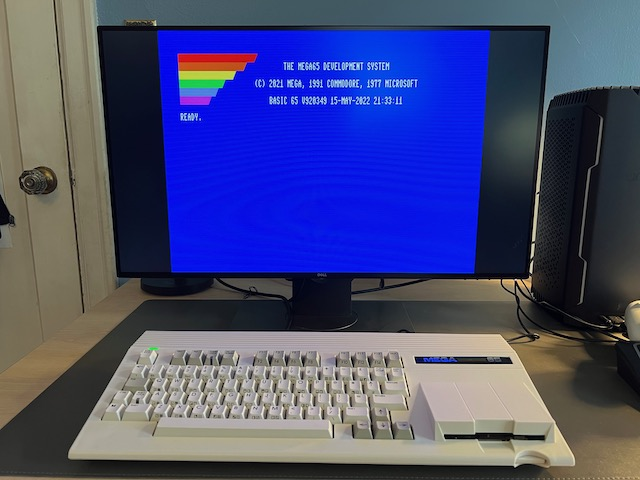
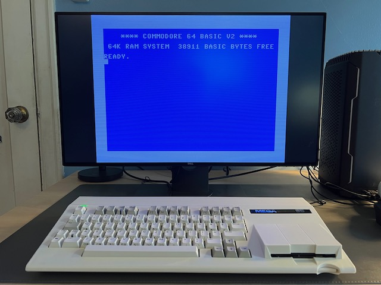
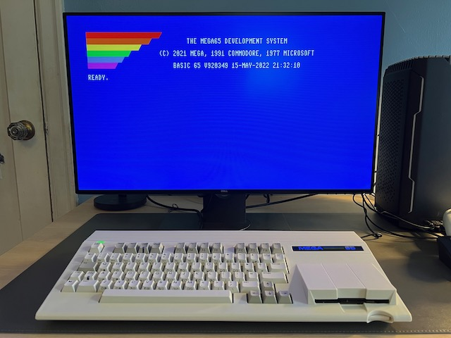
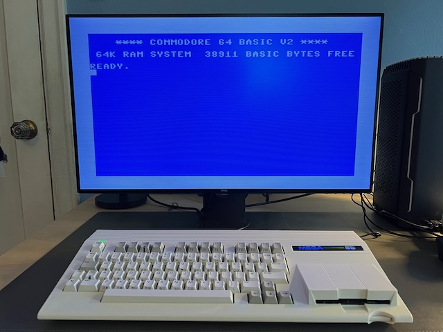
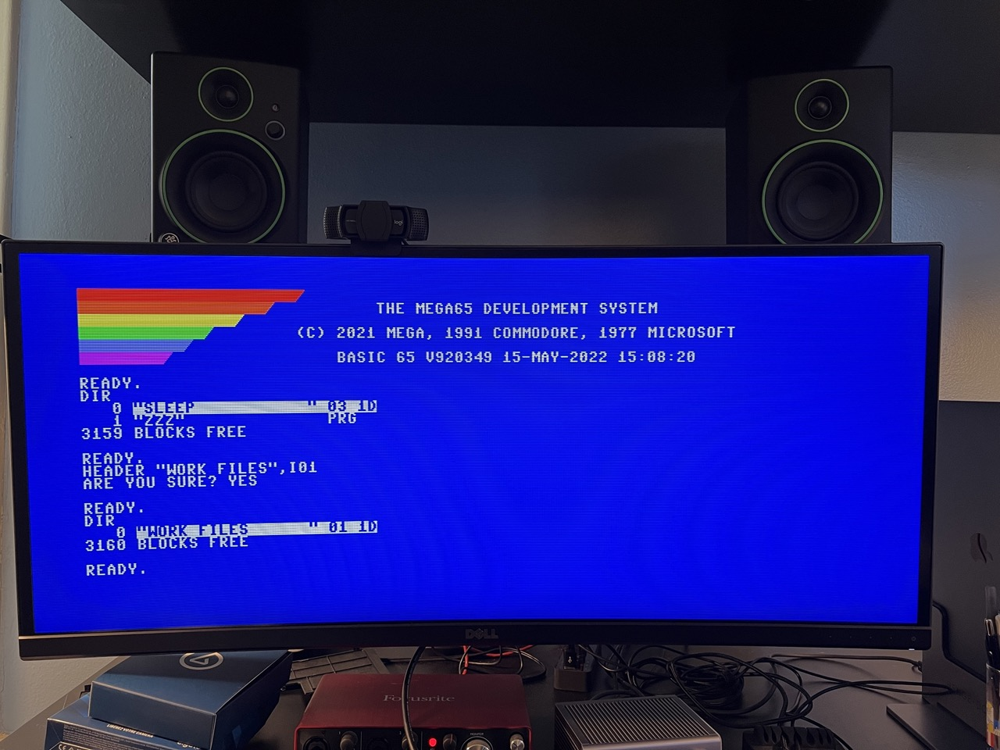
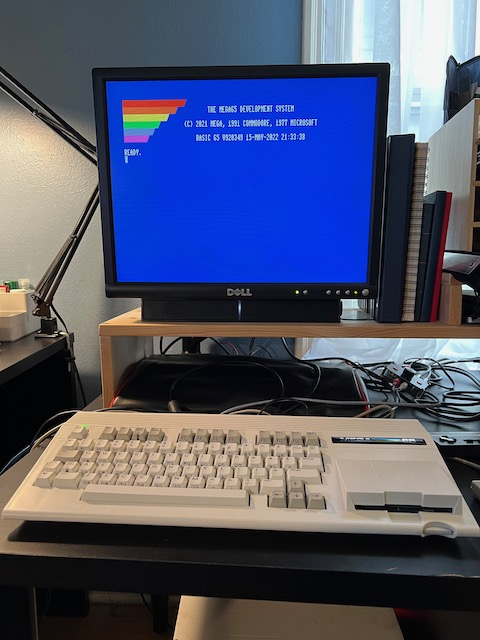
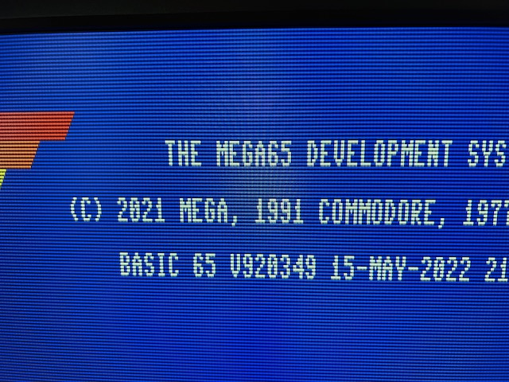
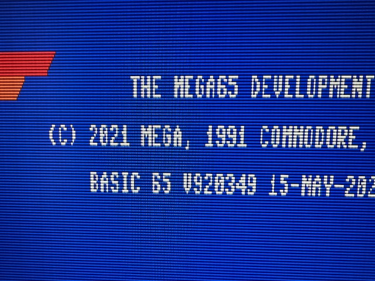

# Video display compatibility

The MEGA65 has two video outputs: one HDMI and one VGA.

## HDMI (DVI)

If you connect the HDMI output to a modern HDMI-capable monitor, you will have a good time. The MEGA65 expects a narrow aspect ratio, but you can usually adjust the aspect ratio on widescreen displays.

These photos show the MEGA65 connected to a Dell UltraSharp 27 widescreen monitor configured to use a 4:3 aspect ratio in the display settings. (Use the buttons on the bottom of the monitor to navigate to the display settings menu.)




Without setting the aspect ratio, most widescreen monitors will stretch the image horizontally to fit. This is undesirable in most cases, but I actually quite like how 80-column BASIC looks when stretched.




Just for fun, here is what 80-column BASIC looks like stretched on a Dell 34" curved ultra-wide display:



If your HDMI display supports audio, enable "enhanced (with audio)" mode in the MEGA65 configuration. Otherwise set it to "DVI only (no audio)."

```{tip}
Be sure to try "CRT emulation" mode in the MEGA65 configuration with a flat panel display to see if you like it.
```

## VGA

If you connect the VGA output to a vintage VGA CRT monitor, you will have a good time. The VGA signal and the expected aspect ratio go well together.

% TODO: photo of VGA display

```{tip}
Be sure to _disable_ CRT emulation in the MEGA65 configuration when using an actual CRT.
```

## 4:3 flat panel displays

If you're looking for the 4:3 aspect ratio of a vintage monitor that won't distort the MEGA65 image but also want the convenience of a flat panel screen, there are options, with tradeoffs that depend on the model of monitor you find. Flat panel displays of the early 2000's ushered out bulky CRTs before widescreen aspect ratios came into fashion. Many have both VGA and DVI (HDMI-compatible) inputs.

I can't possibly list every tradeoff for every monitor, but I can describe my experiences with the Dell 2001FP, a popular choice among vintage computer collectors. The 2001FP is a 20" flat panel display with S-Video, VGA, and DVI inputs. I use an HDMI-to-DVI cable to connect the MEGA65's HDMI output to the DVI input. I also use a VGA cable to connect the MEGA65's VGA output to the VGA input.



Why use both HDMI and VGA with the same display? In the case of the 2001FP, I need both to work around issues with each mode:

- HDMI provides the highest quality display for regular use. With the current (as of this writing) MEGA65 core, some of the utility menus (configuration, core selection) fail to display through the 2001FP DVI input, but work just fine over VGA. This is not a problem for all HDMI output, it only affects the Dell 2001FP DVI input.
- To display VGA, the 2001FP must guess at the signal timing to convert it to the flat panel display. This results in periodic drops of pixel columns. I can adjust the display settings to shift which columns are dropped, but I can't get it to show all columns, even with its automatic adjustment feature. It's fine for the config menus, but a poor experience for regular use, especially the 80-column modes.




With both video outputs connected, I can switch the monitor input as needed without too much hassle.

The HDMI-to-DVI cable does not carry the HDMI audio signal, and the Dell 2001FP doesn't have built-in speakers anyway. I use a Dell soundbar and a separate speaker connection to the MEGA65 audio jack.

```{tip}
If you want a flexible vintage display that works well with vintage computers that use analog RGB signals such as the Amiga, check out [15khz.wikidot.com](http://15khz.wikidot.com/) for recommendations. The Dell 2001FP almost makes the cut: older versions support a 15 kHz signal, newer ones (like mine, alas) do not. I use the 2001FP with my Commodore 64C and an S-Video cable with great success.
```

## Video capture cards

One advantage to having two simultaneous video outputs is you can send one to a monitor and another to a device such as a video capture card. I used VGA to the Dell and HDMI to an [Elgato Camlink](https://www.elgato.com/en/cam-link-4k) to take the screenshots in this Guide.

I was not able to capture screenshots of the C64 core this way. This is likely because the C64 core currently only supports PAL displays.

---

If you have specific results for a popular flat screen display that you believe are worth sharing, [let me know!](mailto:contact@dansanderson.com)
