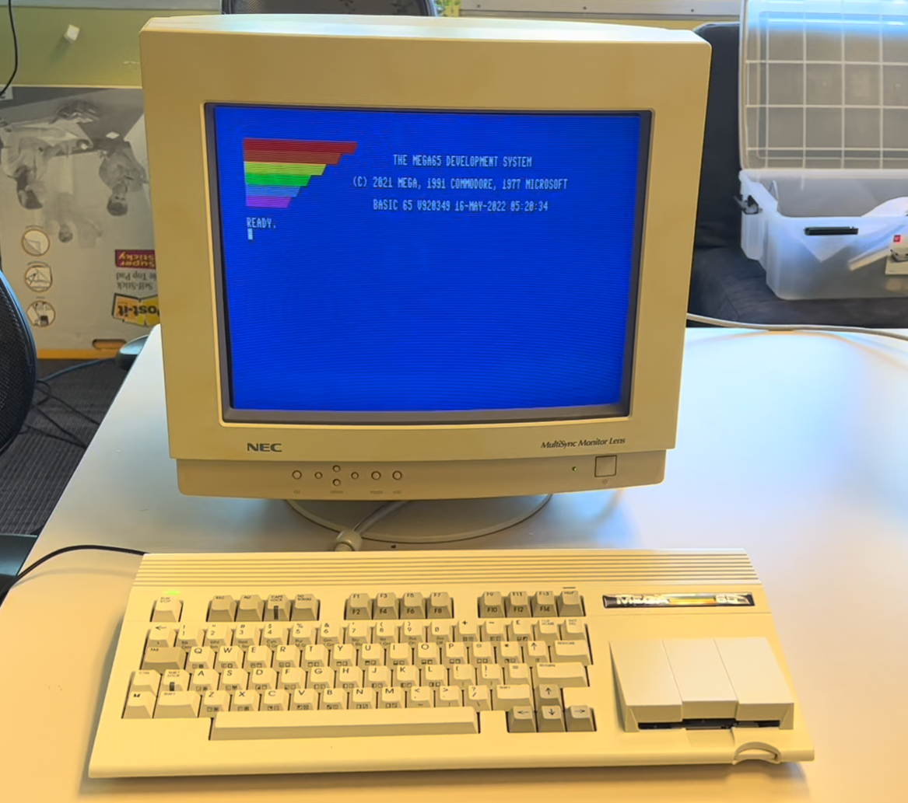

# Video display compatibility

The MEGA65 has two video outputs: one HDMI and one VGA. They mostly work as you would expect, though it may take some fiddling to display the MEGA65 image in a proper aspect ratio. Some vintage displays have caveats.

## HDMI (DVI)

If you connect the HDMI output to a modern HDMI-capable monitor, you will have a good time. The MEGA65 assumes a narrow 4:3 aspect ratio, but you can usually adjust the aspect ratio on widescreen displays. Most HDMI displays can handle the "Enhanced (with audio)" signal, even if the display doesn't have built-in speakers.

Not all HDMI displays can handle both the 60 Hz NTSC refresh rate and the 50 Hz PAL refresh rate. If you are able to test before buying (or can buy one, try it, and return it if it doesn't work), be sure to test both PAL and NTSC modes, especially if you want to run vintage C64 software or the C64 core.

These photos show the MEGA65 connected to a Dell UltraSharp 27 widescreen monitor configured to use a 4:3 aspect ratio in the display settings. (Use the buttons on the bottom of the monitor to navigate to the display settings menu.)


Without setting the aspect ratio, most widescreen monitors will stretch the image horizontally to fit. This is undesirable in most cases, but I actually quite like how 80-column BASIC looks when stretched.


Just for fun, here is what 80-column BASIC looks like stretched on a Dell 34" curved ultra-wide display:


If your HDMI display supports audio, enable "Enhanced (with audio)" mode in the MEGA65 configuration. Otherwise set it to "DVI only (no audio)."

```{note}
With the older cores, the Hypervisor utility menu, Configuration, SD card utility, and core selection screens use "Enhanced (with audio)" mode by default. This fails on older DVI displays that don't know how to handle this signal. You may need to use a modern HDMI display or a VGA display to access these screens. This has been fixed in release v0.96.
```

```{tip}
Be sure to try "CRT emulation" mode in the MEGA65 configuration with a flat panel display to see if you like it.
```

## VGA

If you connect the VGA output to a vintage VGA CRT monitor, you will have a good time. The VGA signal and the expected aspect ratio go well together. The MEGA65 outputs a VGA image with a 31 kHz horizontal scan rate.



```{tip}
Be sure to _disable_ CRT emulation in the MEGA65 configuration when using an actual CRT.
```

## 4:3 flat panel displays

If you're looking for the 4:3 aspect ratio of a vintage monitor that won't distort the MEGA65 image but also want the convenience of a flat panel screen, there are options, with caveats that depend on the model of monitor you find. Flat panel displays of the early 2000's ushered out bulky CRTs before widescreen aspect ratios came into fashion. Many have both VGA and DVI (HDMI-compatible) inputs.

### Dell P1917S

The Dell P1917S is a 19-inch 5:4 aspect ratio flat panel display, with HDMI and VGA inputs. It is my current daily driver with my MEGA65. It works with both PAL and NTSC display modes, and has high quality VGA pixel alignment. Best of all, Dell still manufactures this model, so you can get a new one for $169 USD or [a refurbished one for $110](https://www.amazon.com/gp/product/B08NCX4MN9).

The only caveat with the P1917S: do *not* buy the AC511 SoundBar that goes with it. It *looks* like it will take audio input via the 3.5mm jack, but it requires a USB connection to a Windows computer to operate the volume knob. It's utterly stupid. I'm currently using [a dirt-cheap sound bar from Jeecoo](https://www.amazon.com/Jeecoo-USB-Powered-Computer-Soundbar-Speakers/dp/B0CBMCNC4B) that is USB-powered and has a 3.5mm cable that connects directly to the MEGA65. It sits clumsily under the monitor, but it works.

### Dell 2001FP

I have also had great experiences with the Dell 2001FP, a popular choice among vintage computer collectors. The 2001FP is a 20" flat panel display with S-Video, VGA, and DVI inputs. I use an HDMI-to-DVI cable to connect the MEGA65's HDMI output to the DVI input, with the MEGA65 video configuration set to "DVI only (no audio)." I also use a VGA cable to connect the MEGA65's VGA output to the VGA input.


Why use both HDMI and VGA connections with the same display? In the case of the 2001FP, I need both to work around caveats with each mode:

-   HDMI provides the highest quality display for regular use. With the factory-installed core, some of the utility menus (configuration, core selection) use the "Enhanced (with audio)" HDMI mode, which fails to display through the 2001FP DVI input. These menus work fine over VGA. This is not a problem for all HDMI monitors: it only affects DVI displays that do not support sound over HDMI. (Utility menus were fixed in later cores, but the factory core still gets used in some cases.)
-   To display VGA, the 2001FP must adapt to the signal timing to present it on the flat panel display. This results in periodic drops of pixel columns. It's fine for the configuration menus, but it's a poor experience for regular use.


With both video outputs connected, I can switch the monitor input as needed without too much hassle.

The HDMI-to-DVI cable does not carry the HDMI audio signal, and the Dell 2001FP doesn't have built-in speakers anyway. I use a Dell soundbar and a separate speaker connection to the MEGA65 audio jack.

```{tip}
Is your HDMI output not working with a vintage DVI display? Double-check that you have "DVI only (no audio)" selected in the MEGA65 video configuration. (Use a modern HDMI display or a VGA connection to see the configuration screen.) "Enhanced (with audio)" mode will corrupt the DVI-only signal.
```

```{tip}
If you want a flexible vintage display that works well with vintage computers that use analog RGB signals such as the Amiga, check out [15khz.wikidot.com](http://15khz.wikidot.com/) for recommendations. The Dell 2001FP almost makes the cut: older versions support a 15 kHz signal, newer ones (like mine, alas) do not. I use the 2001FP with my Commodore 64C and an S-Video cable with great success. 15 kHz support is not required for the MEGA65, it's just nice to have for some old machines.
```

## Video capture cards

One advantage to having two simultaneous video outputs is you can send one to a monitor and another to a device such as a video capture card. I used VGA to the Dell and HDMI to an [Elgato Camlink](https://www.elgato.com/en/cam-link-4k) to take the screenshots in this Guide. (You can also take screenshots with the M65Connect app and the JTAG connection. See {ref}`using-jtag:using the jtag connector`.)

I was not able to capture screenshots of the C64 core with the Camlink. The C64 core only knows how to simulate a PAL machine, and the Camlink apparently doesn't like whatever video signal it produces.

## Resolution and aspect ratio

The MEGA65 core produces an image in a resolution and refresh rate that corresponds with the emulated vintage display format: PAL or NTSC.

In PAL mode, MEGA65 produces an image with a resolution of 720 x 576, and a refresh rate of 50 Hz.

In NTSC mode, MEGA65 produces an image with a resolution of 720 x 480, and a refresh rate of 60 Hz.

The MEGA65 image is intended to be rendered in an aspect ratio of 4:3. If you do the math, you may notice that the output resolutions are not 4-to-3: 720:576 = 5:4, and 720:480 = 3:2. In the intended display, the pixels are not meant to be square. The monitor will reshape the pixels to the intended aspect ratio.

This behavior is produced by the MEGA65 core. Other cores may generate images at other resolutions and refresh rates, and may have their own compatibility issues with some displays.

## A List of Monitors

We're maintaining a list of tested monitors in [the MEGA65 Wiki](https://mega65.atlassian.net/wiki/spaces/MEGA65/pages/4292609/Monitors). Feel free to contribute your results!
